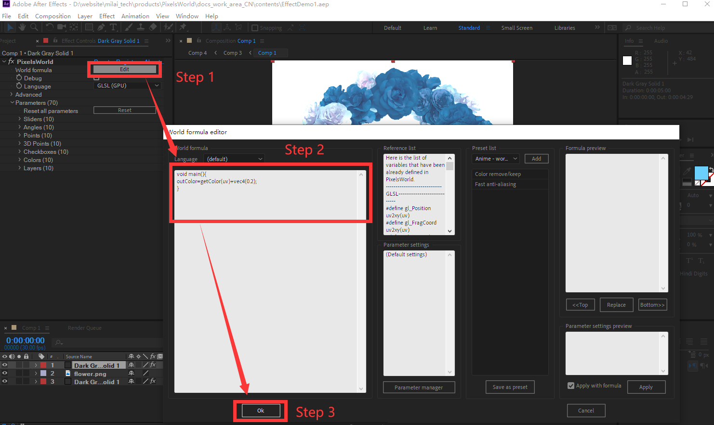

## What Is It Like to Write Shader Code?
Shader code is akin to the *expression function in Excel spreadsheets*. By writing expressions into a spreadsheet, the spreadsheet processes all the data for you.

If we consider the data in the spreadsheet as input pixels and the calculated spreadsheet as output pixels, **coding in the pixel world can be understood as expressions in an Excel spreadsheet.**

## Example: Brightening an Image
To make an image brighter, the simplest calculation is to increase the values of red, green, and blue for all pixels. In an Excel spreadsheet, we would proceed as follows:


This adjusts all the pixel data on the left to be "brighter."

In the pixel world, we would input:

```glsl:bright_describe.shader
outColor=getColor(uv)+vec4(0.2);
```

Translated into plain language: obtain the input pixel at the current position (*uv*) using (*getColor*), add 0.2 to the four channels (red, green, blue, alpha) (*+vec4(0.2)*), and finally assign the calculated result to the output (*outColor*).

Of course, a single line alone doesn't suffice for the pixel world to function correctly; an **outer "shell"** is needed to make it operational! Here is the complete code:
```glsl:bright.shader
void main(){
    outColor=getColor(uv)+vec4(0.2);
}
```
### How to Operate:



### Input Image (Right-click to save):


([Original Source Link](https://www.pixiv.net/artworks/75891619))

### Effect Image:


### Adding More Control!

Typically, simply adding 0.2 to the image isn't ideal; you'd want more control. You can replace `0.2` with `slider[0]`, allowing you to adjust the effect using a slider from the parameters panel.

```glsl:bright_control.shader
void main(){
    outColor=getColor(uv)+vec4(slider[0]);
}
```


However, you'll notice that when the value is negative, the transparency also reduces, which is usually undesirable. If you want to avoid altering the transparency channel, the rendering code should be written as below:

```glsl:bright_control.shader
void main(){
    vec4 inColor = getColor(uv);
    inColor.rgb = inColor.rgb + vec3(slider[0]);
    outColor = inColor;
}
```
> Explanation: First, store the input pixel in a four-dimensional (*vec4*) variable `inColor`, then add the value of `slider[0]` to the rgb (representing red, green, blue) channels. Finally, assign the value of `inColor` to `outColor`, leaving the alpha channel (representing transparency) unchanged in the output.


### Naming Parameters
For a cleaner parameters panel, you can take the following steps:


### Save to Presets
Finally, you can save the code, especially ones you might use later, into presets. Refer to the [Preset Management](../Editor/SavePresets.md) section for more details.

## Congratulations!

You now have a fundamental understanding of using Pixel World!

Pixel World not only allows for code writing but also for finding exciting effects on websites like [shadertoy](https://www.shadertoy.com/) to incorporate into it. For instructions on rendering code from shadertoy, please refer to [here](shadertoy.md).