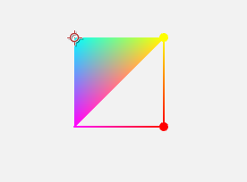

# Creation origin: Poly function

`poly(obj)` analyzes the inputted `obj`, then draws it to the scene. 


## Usage

> If you are familiar with `Houdini`, constructing an `obj` is basically to fill a SpreadSheet. 

Here is an example of constructing an `obj` of an unusual colorful triangle. 



```lua:PolyTest1.lua
version3()
background(0.95)
move(width/2,height/2)
dim3()
dotRadius(5)
obj={
    point={
        {p={0,0,0},color={0,1,1}},
        {p={100,0,0},color={1,1,0}},
        {p={0,100,0},color={1,0,1}},
        {p={100,100,0},color={1,0,0}},
    },
    prim={
        {type="triangle",pref={1,2,3}},
        {type="line",pref={2,3,3,4,4,2}},
        {type="point",pref={2,4}},
    }
}
poly(obj)
```

## Supporting primitives

Assume`pref={1,2,3,4,5,6}`. 

> - `pref` means `point reference`. 
> - The semicolon (`;`) is the end mark of one primitive drawing. 

| type name | Corresponding primitive | Drawing order | full type name |
|---|---|---|---|
|points|Points|`1;2;3;4;5;6;`|points|
|pointd|2d point|`1;2;3;4;5;6;`|point disc|
|pointb|3d point|`1;2;3;4;5;6;`|point ball|
|line|Single line|`123456;`|single line|
|linef|Single 2d line|`123456;`|line flat|
|linec|Single 3d line|`123456;`|line capsule|
|linel|Loop line|`1234561;`|line loop|
|linelf|Loop 2d line|`1234561;`|line loop flat|
|linelc|Loop 3d line|`1234561;`|line loop capsule|
|lines|Lines|`12;34;56;`|lines|
|linesf|2d lines|`12;34;56;`|lines flat|
|linesc|3d lines|`12;34;56;`|lines capsule|
|triangles|Triangle meshes|`123;456;`|triangles|
|triangleb|Bridge structure triangle meshes|`123;324;345;546;`|triangle bridge|
|triangler|Radial structure triangle meshes|`123;134;145;156;`|triangle radial|


## The structure of obj

The obj structure is defined by the following steps: 

- `obj` is a table. 
- `obj` contains 4 keys: `point`,`vertex`,`prim`,`detail`. 
- The 4 keys in `obj` have their value called `pointArray`, `vertexArray`, `primArray`, `detailList`. 
- `pointArray` is required. 
- `vertexArray` is optional. 
- `primArray` is required. 
- `detailList` is optional. 
- The above-mentioned value names that are `Array` suffixed holds N sub-tables, where N can be defined by users. 
- The kth sub-table of `pointArray` is called `point[k]` or `"The kth point"`. 
- The kth sub-table of `vertexArray` is called `vertex[k]` or `"The kth child-point"`.
- The kth sub-table of `primArray` is called `prim[k]` or `"The kth primitive"`. 
- The `detailList` and `Points, child-points, primitives`, have some non-subdividable units：the Key-value pairs. We call these keys `K`, and values `V`.
- `K` should only contain alphabets, numbers, and underlines. And `K` shouldn't be all numbers. 
- `V` has 7 types: `1D`, `2D`, `3D`, `4D`, string, `texture id` and `index serial`. 
- For all double floating numbers `x,y,z,w`
- `x` or `{x}` is `1D V`.
- `{x,y}` is `2D V`.
- `{x,y,z}` is `3D V`.
- `{x,y,z,w}` is `4D V`.
- `"Hello! PixelsWorld!"` is `string V`.
- When (`K` ends up with `"_tex"`) and (`V` is an integer and the corresponding texture exists), it is `texture id V`.
- For integer serial `a1,...,an`,`{a1,a2,a3,...,an}` is `index serial V`.
- For all `point[k]`, there must be a `K` named `"p"` to represents the location, or it is an invalid point.
- For all `vertex[k]`, there must be a `K` named `"pref"` and its `V` is an integer to represent the reference point id, or it is an invalid child-point.
- For all `prim[k]`, there must be a `K` named `"type"` and its `V` is `string` to represents the type of the primitive. And there also must be a `K` named `"vref"`or `"pref"` and its `V` is `index serial` to represent the order of points drawing.

## Override priority

For same `K`, the following override priority is defined: 

> Same with `Houdini`. 

1. vertex
2. point
3. prim
4. detail

Example: 

The following `obj`'s `prim` contains a color attribute (Red), So we will get a red triangle. 


```lua:PrimColor.lua
version3()
background(0.95)
move(width/2,height/2)
dim3()
obj={
    point={
        {p={0,0,0}},
        {p={100,0,0}},
        {p={0,100,0}},
    },
    prim={
        {type="triangle",pref={1,2,3},color={1,0,0}},
    },
}
poly(obj)
```

---

This time, both `prim` and `point` contain `color`, and because the priority of `point` is higher, so the color attribute in `point` will be used, then we will get a colorful triangle. 


```lua:PointColor.lua
version3()
background(0.95)
move(width/2,height/2)
dim3()
obj={
    point={
        {p={0,0,0},color={0,1,1}},
        {p={100,0,0},color={1,1,0}},
        {p={0,100,0},color={1,0,1}},
    },
    prim={
        {type="triangle",pref={1,2,3},color={1,0,0}},
    },
}
poly(obj)
```

## Usage of vertex

Vertex (child-point) inherits all attributes from `point`.


```lua:VertexColor.lua
version3()
background(0.95)
move(width/2,height/2)
dim3()
obj={
    point={
        {p={0,0,0}},
        {p={100,0,0}},
        {p={0,100,0}},
        {p={100,100,0}},
    },
    vertex={
        {pref=1,color={1,0,0}},
        {pref=2,color={1,0,0}},
        {pref=3,color={1,0,0}},
        {pref=2,color={0,1,0}},
        {pref=3,color={0,1,0}},
        {pref=4,color={0,1,0}},
    },
    prim={
        {type="triangle",vref={1,2,3,4,5,6}},
    },
}
poly(obj)
```

> - `pref` is used to define which point to be referenced, the full name of `pref` is `Point reference`.
> - So the `vref` means `Vertex reference`.
> - Note: The index in Lua starts from 1, not 0. 

---

Without vertex, the triangle looks like this: 


```lua:NoVertex.lua
version3()
background(0.95)
move(width/2,height/2)
dim3()
obj={
    point={
        {p={0,0,0},color={1,0,0}},
        {p={100,0,0},color={1,0,0}},
        {p={0,100,0},color={1,0,0}},
        {p={100,100,0},color={0,1,0}},
    },
    prim={
        {type="triangle",pref={1,2,3,2,3,4}},
    },
}
poly(obj)
```


## Extra shader

Yes! You can even write a shader to an obj. 


```lua:FragColor.lua
version3()
background(0.95)
move(width/2,height/2)
dim3()
obj={
    point={
        {p={0,0,0},myattribute={1,0}},
        {p={100,0,0},myattribute={0,1}},
        {p={0,100,0},myattribute={0,0}},
        {p={100,100,0},myattribute={1,1}},
    },
    prim={
        {
            type="triangle",
            pref={1,2,3,2,3,4},
            frag=[==[
                #define t ]==] .. tostring(time) .. [==[

                void main(){
                    outColor = vec4(mod(myattribute*10+vec2(t),1),0,1);
                }
            ]==],
        },
    },
}
poly(obj)
```

## Use texture

> - Here is an example of how to use texture. 
> - The integer that its key name ends up with `_tex` is treated as a texture id. 
> - Using an extra shader in a prim can handle more than one texture. 
> - [More information about texture...](./Texture.md)


```lua:UVTex.lua
version3()
background(0.95)
move(width/2,height/2)
dim3()
obj={
    point={
        {p={0,0,0},uv={0,0}},
        {p={100,0,0},uv={1,0}},
        {p={0,100,0},uv={0,1}},
        {p={100,100,0},uv={1,1}},
    },
    prim={
        {
            type="triangler",
            pref={1,2,4,3},
            my_tex=INPUT,
        },
    },
}
poly(obj)
```
