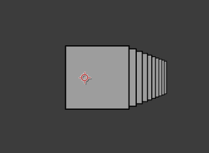

# Render transparent objects
---
Normally, we get the following result when we are about to render a stack of transparent cubes. 




```lua:normalCubes.lua
version3()
in2out()

dim3()
fill(1,.5)

move(width/2, height/2)

for i = 1,10 do
move(20,0,200)
cube()
end
```

The result was wrong, because we cannot see the behind cubes. 

We should adjust the render order (farthest to nearest) basing on the camera distance to obtain the right blending color. 


```lua:sortCubes.lua
version3()
in2out()

dim3()
fill(1,.5)

sortarr = {}

beginGroup()
move(width/2, height/2)
for i = 1,10 do
move(20,0,200)
local x,y,z = global2screen(local2global(0,0,0)) -- Get camera distance
sortarr[i] = {z,getTransformMatrix()} -- {distance, transform status} pairs
end
endGroup()

table.sort(sortarr,function(a,b) -- Sort by z distance
return a[1] > b[1]
end)

for i = 1,10 do
beginGroup(sortarr[i][2]) -- Apply transform status
cube()
endGroup()
end
```