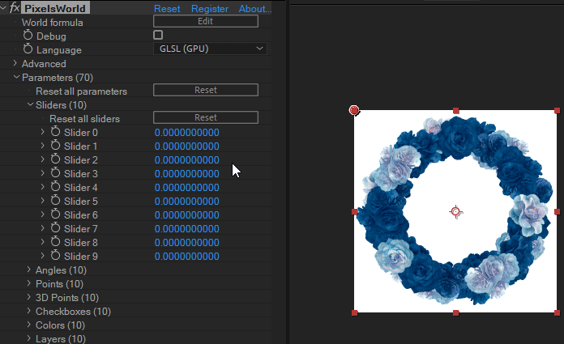

## 写像素世界的代码是什么感觉？
像素世界就像*Excel表格工具*。通过给表格写入表达式，表格会帮你处理所有数据。

如果我们把表格里的数据理解为输入像素，计算后的表格为输出像素，**像素世界的代码就可以理解为Excel表格里的表达式。**

## 使用例：让图像变亮
让一张图像变亮，最简单的计算方法就是让所有像素的红、绿、蓝的数值调高。如果在Excel表格里面，我们需要做如下工作：


这样就可以让左边所有的像素数据都“变亮”了。

换成像素世界，我们就需要输入

```glsl:bright_describe.shader
outColor=getColor(uv)+vec4(0.2);
```

翻译成人话就是：获取当前位置（*uv*）的输入像素（*getColor*），并给四个通道（红、绿、蓝、透明）加上0.2（*+vec4(0.2)*），最后把计算的结果送到（*=*）输出（*outColor*）。

当然只有这一行，像素世界不能正常工作，**外面还要套一层“壳”**就可以正常工作啦！完整代码如下：
```glsl:bright.shader
void main(){
    outColor=getColor(uv)+vec4(0.2);
}
```
### 操作方法：


### 输入图像（右键保存）：


（[源作者链接](https://www.pixiv.net/artworks/75891619)）

### 效果图：


### 加入更多的控制！

当然如果只给图片加0.2通常并不是我们想要的，我们想获取更多的可控性。我们可以把`0.2`换成`slider[0]`，这样的话，我们使用参数面板上的滑竿就可以控制特效了。
```glsl:bright_control.shader
void main(){
    outColor=getColor(uv)+vec4(slider[0]);
}
```


不过你会发现，如果数值是负的时候，透明度也会跟着变小，但我们通常不想修改图像透明度，需要避开修改透明度通道。如果是这样的话，渲染代码就需要写成下面的形式：
```glsl:bright_control.shader
void main(){
    vec4 inColor = getColor(uv);
    inColor.rgb = inColor.rgb + vec3(slider[0]);
    outColor = inColor;
}
```
> 解释：先把输入像素暂存在一个四维(*vec4*)变量`inColor`里，然后把rgb（代表红绿蓝）这三个通道加上`slider[0]`的数值。最后再把`inColor`的值给`outColor`。这样`inColor`的a通道（代表透明通道）就会被原封不动地送入输出。




### 给参数标上名称
我们可以通过如下操作，让我们的参数面板变得整洁一些：


### 保存至预设
最后我们可以将写好的代码，特别是之后可能会用上的代码保存进预设里。请前往[预设管理](contents/Editor/SavePresets.md)章节了解详情。


## 恭喜您！

您已经掌握了像素世界的大体使用流程！

像素世界除了可以自己写入代码外，您还可以去[shadertoy](https://www.shadertoy.com/)网站上找一些好玩的效果放入像素世界。关于如何渲染来自shadertoy的代码，请参阅[这里](contents/GLSL/shadertoy.md)。


<br>
<br>
<br>
<br>
<br>
<br>
<br>