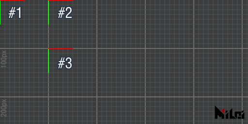
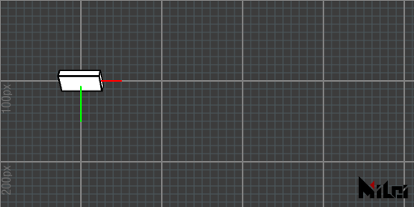
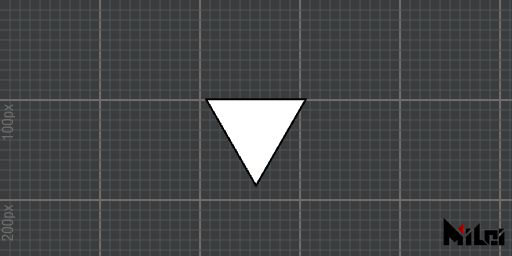
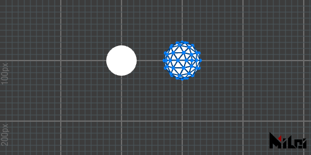
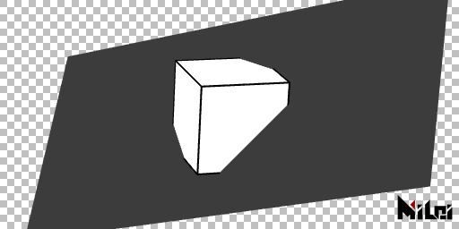
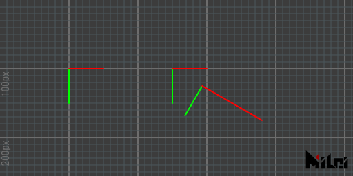
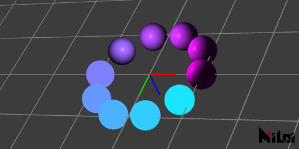

# 函数列表
--- 

以下是定义在PixelsWorld中Lua模式的所有函数。

**必须声明函数**

[version3](#version3)

**获取参数函数**

[slider](LinkParameters.md),
[angle](LinkParameters.md),
[point](LinkParameters.md),
[point3d](LinkParameters.md),
[checkbox](LinkParameters.md),
[color](LinkParameters.md),
[layer](LinkParameters.md)

**输出信息函数**

[print](#print),
[println](#println),
[alert](#alert)

**变换函数**

[move](#move),
[scale](#scale),
[rotate](#rotate),
[rotateX](#rotatex),
[rotateY](#rotatey),
[rotateZ](#rotatez),
[twirl](#twirl)

[beginGroup](#begingroup),
[endGroup](#endgroup),
[beginGlobal](#beginglobal),
[endGlobal](#endglobal)  

[global2local](#global2local),
[local2global](#local2global),
[global2screen](#global2screen),
[screen2global](#screen2global)

[getTransformMatrix](#gettransformmatrix)

**绘制函数**

> 图元

[tri](#tri),
[quad](#quad),
[rect](#rect),
[circle](#circle),
[ellipse](#ellipse),
[par](#par),
[line](#line)

[cube](#cube),
[tet](#tet),
[cone](#cone),
[ball](#ball),
[tube](#tube)

[image](#image),
[imageAlign](#imagealign)

[coord](#coord),
[grid](#grid)

[poly](Poly.md),
[setPoly](#setpoly)

[background](#background),
[in2out](#in2out) 

> 绘制属性控制

[dim2](#dim2),
[dim3](#dim3)

[perspective](#perspective),
[noPerspective](#noperspective)

[fill](#fill),
[noFill](#nofill),
[stroke](#stroke),
[noStroke](#nostroke),
[dot](#dot),
[noDot](#nodot)

[wireframe](#wireframe),
[noWireframe](#nowireframe)

[blendAlpha](#blendalpha),
[noBlendAlpha](#noblendalpha)

[back](#back),
[noBack](#noback)

[pure](#pure),
[phong](#phong),
[anime](#anime)

[rgba](#rgba),
[depth](#depth),
[normal](#normal)

[setDepth](#setdepth)

> 灯光

[ambientLight](#ambientlight),
[pointLight](#pointlight),
[parallelLight](#parallellight)

[clearLight](#clearlight),
[getLight](#getlight)  

> 摄像机

[aeCamera](#aecamera),
[lookAt](#lookat),
[viewSpace](#viewspace)  

> 描边细节

[strokeWidth](#strokewidth),
[strokeDivision](#strokedivision),
[strokeGlobal](#strokeglobal),
[strokeLocal](#strokelocal)  

> 点渲染细节

[dotRadius](#dotradius),
[dotDivision](#dotdivision),
[dotGlobal](#dotglobal),
[dotLocal](#dotlocal) 

> 输出细节

[smooth](#smooth),
[noSmooth](#nosmooth) 

**贴图操作**

[newTex, delTex, getSize, swapTex, drawTo, castTex, blendTex, copyTex, savePNG, loadPNG, saveEXR, loadEXR, rotateTex, flipTex, resizeTex, trimTex](Texture.md)

**工具**

[r2d](#r2d),
[d2r](#d2r)

[map](#map)
[clamp](#clamp)
[step](#step)
[smoothStep](#smoothstep)
[bezier](#bezier)

[rgb2hsl,hsl2rgb,rgb2hsv,hsv2rgb,rgb2cmy,cmy2rgb,rgb2cmyk,cmyk2rgb,cmy2cmyk,cmyk2cmy,hsl2hsv,hsv2hsl](#颜色转换)

[utf8ToLocal](#utf8tolocal),
[localToUtf8](#localtoutf8)

[getGLInfo](#getglinfo),
[getDrawRecord](#getdrawrecord),
[getStatus](#getstatus)

[getAudio](#getaudio)  

[loadString](#loadstring)
[saveString](#savestring)

**读写像素函数**

[getColor](#getcolor),
[setColor](#setcolor),
[getSize](#getsize),


**执行代码函数**

[shadertoy](#shadertoy),
[glsl](#glsl),
[cmd](#cmd),
[lua](#lua),
[runFile](#runfile),
[txt](#txt)  

---
<br><br><br><br><br>
# 详细介绍

## version3

`version3()` 函数是Lua模式必须在第一行声明的函数。它的作用是把`pw3`这个表下的所有函数放到全局域中，如果没有这一行，您需要把所有PixelsWorld提供的函数前面加入`pw3.`前缀，比如之后会介绍的`println()`函数则需要写成`pw3.println()`。相反，如果您在第一行调用了`version3()`函数，则不需要写`pw3.`前缀。这是为了让您的代码能向后兼容而设计的函数。我们推荐（Lua渲染模式下的）任何情况下都在第一行加入`version3()`的调用。

```lua:version3.lua
version3()
println("Hello PixelsWorld! ")
```

```lua:without_version3.lua
pw3.println("Hello PixelsWorld! ")
```

## print

`print(str)`,`print(str,brightness)`,`print(str,r,g,b)`,`print(str,r,g,b,a)`是在屏幕左上角输出信息的函数。


```lua:print.lua
version3()
print("Hello PixelsWorld! ")
str = "Hello, I am colorful PixelsWorld! "
for i=1,#str do
local c = str:sub(i,i)
local phase = math.sin(i/#str*TPI + time*10) / 2 + .5
print(c,phase,1-phase,1,1)
end
```

## println

`println(str)`,`println(str,brightness)`,`println(str,r,g,b)`,`println(str,r,g,b,a)`是在屏幕左上角输出信息的函数。并在每次输出信息后换行。


```lua:println.lua
version3()
println("Hello PixelsWorld! ")
str = "Hello, I am colorful PixelsWorld! "
for i=1,#str do
local c = str:sub(i,i)
local phase = math.sin(i/#str*TPI + time*10) / 2 + .5
-- println(c,phase,1-phase,1,1)
print(c,phase,1-phase,1,1)
end
```

## alert

`alert(str)`是在屏幕左上角输出**警示信息**的函数。它目前等价于`println(str,1,1,0,1)`


```lua:alert.lua
version3()
alert("Warning: Write your message here! ")
```

## move

`move(x,y)`,`move(x,y,z)`是平移画笔坐标的函数。

> 所有变换都是以当前画笔坐标为基准进行的。

例如下面这个例子：




```lua:move.lua
version3()
coord() -- 显示变换前的画笔位置
move(100,0)
coord() -- 显示第1次变换后的画笔位置
move(0,100)
coord() -- 显示第2次变换后的画笔位置
```
最终画笔会在`(100,100,0)`位置处。


## scale

`scale(ratio)`,`scale(x,y)`,`scale(x,y,z)`是缩放画笔坐标的函数。
> 所有变换都是以当前画笔坐标为基准进行的。


```lua:scale.lua
version3()
move(100,100)
scale(2)
rect(50,25)
```

--- 


```lua:no_scale.lua
version3()
move(100,100)
--scale(2)
rect(50,25)
```


## rotate
## rotateX
## rotateY
## rotateZ

`rotate(theta)`是把画笔坐标旋转`theta`弧度的函数，`rotateX(theta)`则是把画笔坐标沿着其X轴旋转的函数，`rotate(theta)`本质等价于`rotateZ(theta)`。
> - 所有变换都是以当前画笔坐标为基准进行的。
> - 如果您不熟悉弧度，可以用函数`d2r(degree)`来把角度转成弧度。例如：`rotate(d2r(90))`则是旋转九十度。


```lua:rotate_degree.lua
version3()
move(100,100)
rotate(d2r(45))
rect(50,25)
```
---


```lua:rotate_radian.lua
version3()
move(100,100)
rotate(PI/4)
rect(50,25)
```
---


```lua:rotateX.lua
version3()
dim3()
move(100,100)
grid()
coord()
rotateX(d2r(45))
cube(50,25,10)
```
---


```lua:rotateY.lua
version3()
dim3()
move(100,100)
grid()
coord()
rotateY(d2r(45))
cube(50,25,10)
```

---


```lua:rotateZ.lua
version3()
dim3()
move(100,100)
grid()
coord()
rotateZ(d2r(45))
cube(50,25,10)
```

## twirl
`twirl(theta,x,y,z)`是沿着`(x,y,z)`轴旋转`theta`弧度画笔的函数。比如，上面的`rotateX(theta)`则等价于这里的`twirl(theta,1,0,0)`。
> - 所有变换都是以当前画笔坐标为基准进行的。
> - `twirl`是对四元数旋转的一种矩阵实现。


```lua:twirl.lua
version3()
dim3()
move(100,100)
grid()
coord()
stroke(1,1,0)
line(-50,-50,-50,50,50,50)
stroke(0,0,0)
twirl(d2r(90),1,1,1)
cube(50,25,10)
```

## beginGroup
## endGroup
1. `beginGroup()`,`endGroup()`是创建父子级关系的函数。`beginGroup()`到`endGroup()`之间的变换(`move,scale,rotate,twirl`)在`endGroup()`之后会被撤销掉。
1. `beginGroup(mat)`创建父子级关系并把4x4矩阵mat推入场景。（可以用[getTransformMatrix](#gettransformmatrix)来获得变换矩阵。）
> 它等价于Processing中的`pushMatrix()`和`popMatrix()`

例如：下面两块代码是等价的


```lua:group.lua
version3()
for i = 1,6 do
beginGroup()
move(i*25,i*25)
rotate(d2r(15*i))
rect(25)
endGroup()
end
```

---


```lua:without_group.lua
version3()
for i = 1,6 do
move(i*25,i*25)
rotate(d2r(15*i))
rect(25)
rotate(d2r(-15*i))
move(-i*25,-i*25)
end
```

## beginGlobal
## endGlobal
夹在`beginGlobal`,`endGlobal`之间的绘图函数
将暂时以全局坐标系绘制


```lua:beginGlobal.lua
version3()
move(100,100)
fill(0,1,0) -- green
rect(50) -- Dran on (100,100,0)
beginGlobal()
fill(1,0,0) -- red
rect(50) -- Draw on (0,0,0)
endGlobal()
move(100,100)
fill(0,0,1) -- blue
rect(50) -- Draw on (200,200,0)
```

## global2local

`global2local(x,y,z)`将全局坐标转为局部坐标。返回三个double。


```lua:global2local.lua
version3()
move(100,100)
rect(25)
move(0,50)
rotate(d2r(30))
coord()
x,y,z=global2local(100,100,0)
println("The local coordinate of the rectangle is:\n (" .. x .. ", " .. y .. ", " .. z .. ").")
```


## local2global

`local2global(x,y,z)`将局部坐标转为全局坐标。返回三个double。


```lua:local2global.lua
version3()
move(100,100)
move(0,50)
rotate(d2r(30))
coord()
move(25,50)
rect(25)
x,y,z=local2global(0,0,0)
println("The global coordinate of the rectangle is:\n (" .. x .. ", " .. y .. ", " .. z .. ").")
```

## global2screen

`global2screen(x,y,z)`将全局坐标转为屏幕坐标。返回三个double。

> 此转换受透视与否影响


```lua:global2screen.lua
version3()
dim3()
move(100,100,0)
move(0,50,0)
rotateZ(d2r(30))
coord()
move(25,50,0)
cube(25)
x,y,z=global2screen(local2global(0,0,0))
println("The screen coordinate of the rectangle is:\n (" .. x .. ", " .. y .. ", " .. z .. ").")
```

## screen2global

`screen2global(x,y,z)`将屏幕坐标转为全局坐标。返回三个double。

> 此转换受透视与否影响


```lua:screen2global.lua
version3()
dim3()

x,y,z=screen2global(0,0,0)
println("The global coordinate of the camera is:\n (" .. x .. ", " .. y .. ", " .. z .. ").")
```

## getTransformMatrix

`getTransformMatrix()`将返回一个列主体的4x4变换矩阵。这个变换矩阵可以应用在`beginGroup(mat)`里。

> `mat[i][j]`可以访问第`i`列第`j`行元素。(`i`,`j`范围1~4)

例子：


```lua:matrix.lua
version3()
dim3()

beginGroup()
move(width/3,height/3)
twirl(d2r(30),1,1,1)
cubetransform = getTransformMatrix()
endGroup()

beginGroup(cubetransform)
cube(50)
endGroup()
```

## tri
1. `tri(radius)`以半径为`radius`的圆做一个内接正三角形，并指向画笔坐标y轴正方向。
1. `tri()`等价于`tri(100)`
1. `tri(w,h)`以底边为`w`高为`h`做一个等腰三角形。
1. `tri(p1x,p1y,p2x,p2y,p3x,p3y)`以`p1,p2,p3`2个二维点为顶点做三角形
1. `tri(p1x,p1y,p1z,p2x,p2y,p2z,p3x,p3y,p3z)`以`p1,p2,p3`3个三维点为顶点做三角形

> - 如果想要观察三维三角形，请在`version3()`函数后加入`dim3()`，并在Ae图层中建立摄像机观测。
> - 前3种方式构造的三角形的法线默认为画笔坐标z轴负方向，后2种方式构造的三角形则以`cross(p1-p2,p3-p2)`定几何法线。
> - 函数名为`triangle`的缩写



```lua:tri1.lua
version3()
move(width/2,height/2)
tri(100)
```
---


```lua:tri5.lua
version3()
dim3()
move(width/2,height/2)
tri(0,0,100,50,0,0,0,50,0)
```

## quad
1. `quad(p1x,p1y,p2x,p2y,p3x,p3y,p4x,p4y)`
1. `quad(p1x,p1y,p1z,p2x,p2y,p2z,p3x,p3y,p3z,p4x,p4y,p4z)`

> - 以`p1,p2,p3`的顺序绘制第一个三角形，以`p1,p3,p4`的顺序绘制第二个三角形。


```lua:quad.lua
version3()
move(200,100)
quad(0,0,75,0,50,40,0,15)
```

## rect

1. `rect(size)`绘制size尺寸的正方形
2. `rect()`等价于`rect(100)`
3. `rect(width,height)`绘制长`width`高`height`的长方形

> - 长方形将以画笔坐标中心为对角线交点生成。
> - 函数名为`rectangle`的缩写


```lua:rect.lua
version3()
move(200,100)
rect(100,75)
```

## circle

1. `circle(radius)`绘制一个半径为`radius`的圆
2. `circle()`等价于`circle(100)`
3. `circle(radius, div)`绘制一个半径为`radius`，分段数为`div`的圆。

> 默认分段为128


```lua:circle.lua
version3()

move(100,100)
fill(1,0,0)
circle(25)

move(100,0)
fill(0,1,0)
circle(25,10)

move(100,0)
fill(0,0,1)
circle(25,3)
```

## ellipse
1. `ellipse(radiusx,radiusy)`绘制一个x半径为`radiusx`，y半径为`radiusy`的椭圆
2. `ellipse()`等价于`ellipse(100,100)`
3. `ellipse(radiusx,radiusy,div)`绘制一个x半径为`radiusx`，y半径为`radiusy`分段`div`的椭圆

> 默认分段为128


```lua:ellipse.lua
version3()

move(100,100)
fill(1,0,0)
ellipse(25,15)

move(100,0)
fill(0,1,0)
ellipse(25,15,10)

move(100,0)
fill(0,0,1)
ellipse(25,15,4)
```

## line

1. `line(p1x,p1y,p2x,p2y)`绘制一条线段
1. `line(p1x,p1y,p1z,p2x,p2y,p2z)`绘制一条三维线段
1. `line()`等价于`line(0,0,0,100,100,100)`

> - 线的颜色是由`stroke(r,g,b)`控制的。
> - 线的粗细是由`strokeWidth(width)`控制的
> - 线默认是被渲染出来的，屏蔽线渲染请使用`noStroke()`，开启线渲染则用`stroke()`


```lua:line.lua
version3()

move(200,100,0)
stroke(1,0,0)
line(0,0,0,50)

move(100,0,0)
stroke(0,1,0)
line(0,0,0,50)

move(100,0,0)
stroke(0,0,1)
line(0,0,0,50)
```
---


```lua:line_circle.lua
version3()
math.randomseed(1)
num = 32

move(width/2,height/2)

for i=1,num do
    beginGroup()
    rotateZ(d2r(360/num*i))
    strokeWidth(math.random()*3)
    line(0,0,100,0)
    endGroup()
end
```

## par

1. `par(x)` 绘制一个位置为`(x,0,0)`的点
2. `par(x,y)` 绘制一个位置为`(x,y,0)`的点
3. `par(x,y,z)` 绘制一个位置为`(x,y,z)`的点
4. `par()`等价于`par(0,0,0)`

> - 点渲染默认是关闭的，请使用`dot()`打开。并且您随时可以调用`noDot()`关闭它
> - 点的半径由`dotRadius(radius)`控制
> - 点的颜色由`dot(r,g,b)`控制
> - 如果您不想让点被变换压扁或者缩小，使用`dotGlobal()`。默认情况下点是在`dotLocal()`模式下渲染的。


```lua:par.lua
version3()

dot()
dotRadius(3)
move(200,100)
par()

dot(1,0,0)
dotRadius(7)
move(100,0)
par()
```


## cube

1. `cube(size)`绘制一个边长为size的正方体
1. `cube(sizex,sizey,sizez)`绘制一个长宽高`sizex,sizey,sizez`的长方体
1. `cube()`等价于`cube(100)`
1. `cube()`

> 长方体的法线默认是朝外的，如果输入负数长度、或者使用了带负号的`scale()`函数会导致法线向内


```lua:cube.lua
version3()
dim3()

move(200,100,0)
rotateY(d2r(30))
rotateX(d2r(30))
cube(40,25,10)
```

## tet 

1. `tet(radius)`以`radius`为球面半径绘制一个内接正四面体
1. `tet()`等价于`tet(50)`
1. `tet(p1x,p1y,p1z,p2x,p2y,p2z,p3x,p3y,p3z,p4x,p4y,p4z)`以`p1,p2,p3,p4`为顶点绘制一个四面体

> - 第三项绘制的四面体的法线根据绘制顺序而定，具体为：`p1,p2,p3;p2,p1,p4;p3,p2,p4;p1,p3,p4.`的顺序依次绘制四个三角面。关于三角面的法线方向请参考[`tri`](#tri)
> - 函数名为`tetrahedron`的缩写


```lua:tet.lua
version3()
dim3()

move(200,100,0)
tet(0,0,0,
100,0,0,
0,100,0,
30,20,-50
)
```

## cone

1. `cone(size)`以size为底边半径，2*size为高，绘制一个圆锥
1. `cone()`等价于`cone(50)`
1. `cone(radius,height)`以radius为半径，height为高绘制一个圆锥
1. `cone(radius,height,div)`以radius为半径，height为高绘制一个分段为div的圆锥

> - 圆锥默认分段为64
> - 当分段大于16时会隐藏锥面描边和底边顶点
> - 负数的输入值或带负号的`scale()`有可能导致法线向内


```lua:cone.lua
version3()
dim3()
move(100,100,0)

beginGroup()
rotateY(d2r(60))
cone(25)
endGroup()

move(100,0,0)
beginGroup()
rotateY(d2r(60))
noStroke()
cone(25)
endGroup()

move(100,0,0)
beginGroup()
rotateY(d2r(60))
stroke(1,0,0)
dot(1,1,0)
dotRadius(3)
cone(30,100,12)
endGroup()
```


## ball

1. `ball(radius)`以半径radius绘制一个三维球体
1. `ball()`等价于`ball(50)`
1. `ball(radius,level)`以半径radiu和level细分等级绘制一个球体

> - 默认level为4
> - level必须大于等于0
> - level等于0时为正八面体
> - level大于2时将隐藏描边和顶点
> - 负数的输入值或带负号的`scale()`有可能导致法线向内



```lua:ball.lua
version3()
dim3()
move(200,100,0)

beginGroup()
rotateY(d2r(60))
ball(25)
endGroup()

move(100,0,0)
beginGroup()
rotateY(d2r(60))
stroke(0,0.25,0.5)
dot(0,0.5,1)
dotRadius(3)
ball(30,2)
endGroup()
```


## tube

1. `tube(size)`绘制一个底面半径`size`、高`2*size`的圆柱体
1. `tube()`等价于`tube(50)`
2. `tube(radius,height)`绘制一个半径为radius、高为height的圆柱体
3. `tube(radius1,radius2,height)`绘制一个靠近绘笔坐标原点底面半径为radius1、远离一侧底面半径为radius2、高为height的圆柱体
4. `tube(radius1,radius2,height,div)`在第4个函数基础上多了分段的控制。
5. `tube(radius1,radius2,height,div,needMesh)`在第5个函数基础上多了“是否要渲染两个圆面”的boolean
6. `tube(radius1,radius2,height,div,needMesh1,needMesh2)`在第5个函数基础上，多了“是否要渲染近侧底面”的needMesh1和“是否要渲染远侧底面”的needMesh2，两者皆为boolean。

> - `div`默认值为64
> - `needMesh`默认值为`true`
> - 当分段大于16时会隐藏柱面描边和两底边顶点
> - 负数的输入值或带负号的`scale()`有可能导致法线向内


```lua:tube.lua
version3()
dim3()
move(200,100,0)

beginGroup()
rotateY(d2r(60))
tube(25)
endGroup()

move(100,0,0)
beginGroup()
rotateY(d2r(60))
stroke(1,0.25,0.5)
dot(0,0,1)
dotRadius(3)
tube(30,25,50,8)
endGroup()
```


## image

1. `image(id,width,height)`以长度为width,高为height绘制一张图片到场景上

> - id是材质编号，`PARAM0`~`PARAM9`是您插件面板上的图层控件获得的材质，`INPUT`是输入插件的输入图像，`OUTPUT`是输出图像。
> - 当您指定id为`OUTPUT`时，因为`OUTPUT`是您当前正绘制的充当绘板的材质，所以会发生一次绘板的截屏行为。因此会比其它参数稍慢一些。
> - 这个函数与`in2out(id)`的区别是，`image(id,width,height)`会根据绘笔坐标生成一个与场景深度信息互动的图片。这意味着：图片默认绘制出来是上下颠倒的，因为Ae默认的坐标系y轴向下，您需要在前面加入一行`rotateX(PI)`来转正（我们不推荐使用`scale(1,-1)`,这将会导致其它后续绘制图形出现法线错误）；而`in2out(id)`则是忽略深度信息，直接把像素写到当前绘板中（并且没有上下颠倒问题）。

下面这个例子将演示一个与输入图片穿插交互的立方体



```lua:render_image.lua
version3()
dim3()
move(width/2,height/2)
twirl(d2r(45),-1,1,0)
beginGroup()
rotateX(d2r(180))
image(INPUT,width,height)
endGroup()
twirl(d2r(60),1,1,1)
cube()
```

## imageAlign

`imageAlign(rule)`来更改`image`函数的图片朝向。`rule`遵循以下规则：
- rule为4个字符
- 第1个字符为`+`或`-`
- 第2个字符为`x,y,z`中任意一个
- 第3个字符为`+`或`-`
- 第4个字符为`x,y,z`中任意一个

`rule`代表图片的UV坐标（左下角为原点）与绘笔坐标的什么轴向对齐，默认`rule`为`"+x+y"`，代表u轴与正x对齐，v轴与正y对齐。

> `v3.3.0`新函数


```lua:imageAlign.lua
version3()
dim3()

move(100,100,0)
coord()
image(PARAM0,128,128)

move(150,0,0)
coord()
imageAlign("+x-y")
image(PARAM0,128,128)

move(150,0,0)
coord()
imageAlign("+z-y")
image(PARAM0,128,128)
```

## coord

`coord()`将把当前绘笔坐标可视化出来。



```lua:coord.lua
version3()

move(100,100)
coord()

move(150,0)
coord()

rotate(d2r(30))
move(50,0)
scale(2,1)
coord()
```

## grid 

`grid()`将把当前绘笔坐标所在的xy平面以100x100网眼大小的的网格可视化出来。


```lua:grid.lua
version3()

move(width/2,height/2)
rotate(d2r(30))
grid()
```

## setPoly

`setPoly(obj)`可以提前解析要绘制的物体信息，您在设置后可以调用`poly()`来快速绘制刚刚设置的物体。

> - 当您在场景中绘制多次同一个obj时，使用这个函数提前设置obj会很有效。
> - 关于obj的构造请前往[Poly](Poly.md)章节

## background

`background(brightness)`,`background(r,g,b)`,`background(r,g,b,a)`将当前绘板涂成对应颜色。

> - 注意：如果您之前绘制过形状，这些形状会被覆盖。


```lua:background.lua
version3()

background(1,1,0)
```

## in2out

1. `in2out(id)`会把第id个层参数设为背景。
1. `in2out()`等价于`in2out(INPUT)`，它负责把输入层当做背景。

> `id` 范围：  `PARAM0`~`PARAM9` 或者 `INPUT`。

## dim2

`dim2()`将使用2D模式绘图，这一项默认是开启的，一般您无需调用。

> 本质PixelsWorld中的2D模式是没有深度信息的正交3D模式。

## dim3

`dim3()`将使用3D模式绘图。我们推荐声明在紧随`version3()`之后的地方。

> 注意：如果在跟合成尺寸不同的图层上渲染3D形状时请使用[`viewSpace`](#verspace)更改摄像机的远平面尺寸，否则会得到意外的位置结果。

## perspective

`perspective()`将使用透视视图渲染，物体将符合近大远小规则，您可以使用[viewSpace](#viewspace)来调整摄像机信息、使用[lookAt](#lookat)来调整摄像机位置。
> 若您调用过`dim3()`，透视模式默认开启。

## noPerspective

`noPerspective()`将使用正交视图渲染，物体互相平行的边缘在渲染视图中也将平行。


```lua:noPerspective.lua
version3()

dim3()
n = 20
move(100,100,0)
beginGroup()
rotateX(d2r(85))
for i=1,n do
    move(0,300,0)
    fill(i/n,1-i/n,1)
    cube(50)
end
endGroup()

move(300,0,0)
noPerspective()
beginGroup()
rotateX(d2r(85))
for i=1,n do
    move(0,300,0)
    fill(i/n,1-i/n,1)
    cube(50)
end
endGroup()
```

## fill

1. `fill()`将开启填充。默认开启。
1. `fill(brightness)`,`fill(r,g,b)`,`fill(r,g,b,a)`将开启填充并设置填充色。

> - 注意：在3D模式中，如果您将填充的透明值设为小于1的数的时候，请使用由远到近的顺序渲染物体，否则前面的透明物体会完全遮挡住后面的物体。（这是OpenGL绘图的一个特性）

## noFill

`noFill()`将关闭填充。


```lua:fill.lua
version3()

move(200,100,0)
fill(1,0,0)
rect(50)

move(100,0,0)
fill(1,1,0)
rect(50)

move(100,0,0)
noFill()
rect(50)
```


## stroke

1. `stroke()`将开启描边。默认开启。
1. `stroke(brightness)`,`stroke(r,g,b)`,`stroke(r,g,b,a)`将开启描边并设置描边色。

## noStroke

`noStroke()`将关闭描边。


```lua:stroke.lua
version3()

fill(0)
move(200,100,0)
stroke(1,0,0)
rect(50)

move(100,0,0)
stroke(1,1,0)
rect(50)

move(100,0,0)
noStroke()
rect(50)
```


## dot

1. `dot()`开启顶点渲染。默认关闭。
1. `dot(brightness)`,`dot(r,g,b)`,`dot(r,g,b,a)`将开启顶点渲染并设置顶点渲染颜色。

## noDot

`noDot()`将关闭顶点渲染。


```lua:dot.lua
version3()

fill(1)
move(200,100,0)
stroke(1,0,0)
rect(50)

move(100,0,0)
dot(1,1,0)
rect(50)

move(100,0,0)
noDot()
rect(50)
```


## wireframe

`wireframe()`将开启线框模式。

## noWireframe

`noWireframe()`将关闭线框模式。


```lua:wireframe.lua
version3()
n=8
dim3()

move(width/2, height/2)
for i=1,n do
    if i>n//2 then wireframe()
    else noWireframe() end
    beginGroup()
    rotateZ(d2r(i*360/n))
    move(100,0,0)
    fill(i/n,1-i/n,1)
    ball(30,1)
    endGroup()
end
```


## blendAlpha

`blendAlpha()`将开启混色。

## noBlendAlpha

`noBlendAlpha`将关闭混色。


```lua:blendAlpha.lua
version3()
castTex(OUTPUT,INPUT)

move(200,100,0)
fill(1,0,0,0.2)
rect(80)

move(100,0,0)
noBlendAlpha()
fill(1,0,0,0.2)
rect(80)
```

## back

`back()`填充含透明色的时候，将显示物体背面。默认关闭。

## noBack

`noBack()`关闭背面渲染模式。


```lua:back.lua
version3()
dim3()
fill(1,0,0,0.2)

rotateX(d2r(30))
rotateY(d2r(-15))
move(200,180,0)
cube(80)

move(150,0,0)
back()
cube(80)
```

## pure

`pure()`将使用纯色模式渲染场景。默认开启。

> anime,phong,pure是三种不能同时应用的材质，您在打开其中一个的时候另外两种会被关掉。

## phong

1. `phong(ambient,diffuse,specular,specularPower)`将切换到phong模式，并把环境光反射强度设为ambient、亮面漫反射强度设为diffuse、高光强度设为specular。specularPower负责设置高光衰减量级，该项越大，高光衰减越快。
1. `phong()`将切换到phong材质模式。不改动设置。

> - 默认场景是没有任何光源的，所以您需要使用[getLight()](#getlight)，或[ambientLight()](#ambientlight)、[parallelLight()](#parallellight)、[pointLight](#pointlight)来获取光源。
> - 如果在有光源的前提下渲染出来的物体仍然是纯黑色，调用[normal](#normal)请检查法线是否正确。
> - 每一项参数初始值为：ambient:1,diffuse:1,specular:1,specularPower:1
> - anime,phong,pure是三种不能同时应用的材质，您在打开其中一个的时候另外两种会被关掉。
> - 请在使用前执行[dim3()](#dim3)



```lua:phong.lua
version3()
dim3()

move(width/2,height/2,0)

grid()
coord()

n=10

beginGroup()
move(0,0,-100)
pointLight()
endGroup()

for i=1,n do
    beginGroup()
    rotateZ(d2r(i*360/n))
    move(100,0,0)
    fill(i/n,1-i/n,1)
    if(i<=n//2) then pure()
    else phong() end
    ball(25)
    endGroup()
end
```


## anime

1. `anime(ambient,diffuse,specular,specularPower,diffuseThreshold,specularThreshold)`
1. `anime()`将切换到动漫材质模式。不改动设置。

> - anime材质是在[phong](#phong)的基础上做的。因此前四项参数：ambient,diffuse,specular,specularPower与phong相同，剩余两项diffuseThreshold负责设置漫反射的阈值，当漫反射亮度超过阈值时则设为亮面，低于阈值时则设置为暗面。同理，specularThreshold负责高光的阈值。
> - anime材质对抗锯齿进行了优化，如果您开启了抗锯齿（默认开启），那么光影过渡边缘会被抗锯齿处理。关闭插件面板的抗锯齿设置可以关闭光影边缘的抗锯齿处理。
> - 每一项参数初始值为：ambient:1,diffuse:1,specular:1,specularPower:1,diffuseThreshold:0.5,specularThreshold:0.8
> - anime,phong,pure是三种不能同时应用的材质，您在打开其中一个的时候另外两种会被关掉。
> - 请在使用前执行[dim3()](#dim3)


```lua:anime.lua
version3()
dim3()

move(width/2,height/2,0)

grid()
coord()

n=10

beginGroup()
move(0,0,-100)
pointLight()
endGroup()

for i=1,n do
    beginGroup()
    rotateZ(d2r(i*360/n))
    move(100,0,0)
    fill(i/n,1-i/n,1)
    if(i<=n//2) then pure()
    else anime() end
    ball(25)
    endGroup()
end
```


## rgba

`rgba()`RGBA直接输出模式，默认开启。

> - rgba,depth,normal是三个不能同时成立的模式，您在打开其中一项的时候另外两项会被关掉。
> - 这个模式可以使用材质。


```lua:rgba.lua
version3()
dim3()
background(1)
move(width/2,height/2,0)

n=10

beginGroup()
move(0,0,-100)
pointLight()
endGroup()

rgba()
-- depth()
-- normal()

noStroke()
for x=1,n do
    for y=1,n do
        for z=1,n do
            beginGroup()
            fill(x/n,y/n,z/n)
            move(map(x,1,n,-n/2,n/2)*50,map(y,1,n,-n/2,n/2)*50,map(z,1,n,-n/2,n/2)*200)
            ball(10,2)
            endGroup()
        end
    end
end
```

## depth

`depth(blackDistance, whiteDistance)`是把深度当做亮度信息输出的模式。例如您想输出一张深度图，可以指定blackDistance和whiteDistance来设置距离摄像机多远的时候输出黑色或白色。对于之间的距离，像素世界会做线性插值成灰色。当您把blackDistance和whiteDistance设为同一数值时，像素世界会把您设置的数值当做阈值来输出纯黑色或纯白色。

> - rgba,depth,normal是三个不能同时成立的模式，您在打开其中一项的时候另外两项会被关掉。
> - 这个模式会无视材质。
> - 请在使用前执行[dim3()](#dim3)


```lua:depth.lua
version3()
dim3()
background(1)
move(width/2,height/2,0)

n=10

beginGroup()
move(0,0,-100)
pointLight()
endGroup()

-- rgba()
depth()
-- normal()

noStroke()
for x=1,n do
    for y=1,n do
        for z=1,n do
            beginGroup()
            fill(x/n,y/n,z/n)
            move(map(x,1,n,-n/2,n/2)*50,map(y,1,n,-n/2,n/2)*50,map(z,1,n,-n/2,n/2)*200)
            ball(10,2)
            endGroup()
        end
    end
end
```


## normal

1. `normal(faceToCamera, normalize)`切换到normal模式，修改faceToCamera和normalize变量
1. `normal(faceToCamera)`切换到normal模式，只修改faceToCamera变量
1. `normal()`只负责切换到normal模式

> - `faceToCamera`是一个布尔值，用来控制normal是否以摄像机视角为基准生成。
> - `normalize`是一个布尔值，用来指定是否输出标准化(长度做成1)后的normal
> - 初始值：faceToCamera:true, normalize:true。
> - rgba,depth,normal是三个不能同时成立的模式，您在打开其中一项的时候另外两项会被关掉。
> - 这个模式会无视材质。
> - 请在使用前执行[dim3()](#dim3)


```lua:normal.lua
version3()
dim3()
background(.5,.5,1)
move(width/2,height/2,0)

n=10

beginGroup()
move(0,0,-100)
pointLight()
endGroup()

-- rgba()
-- depth()
normal()

noStroke()
for x=1,n do
    for y=1,n do
        for z=1,n do
            beginGroup()
            fill(x/n,y/n,z/n)
            move(map(x,1,n,-n/2,n/2)*50,map(y,1,n,-n/2,n/2)*50,map(z,1,n,-n/2,n/2)*200)
            ball(10,2)
            endGroup()
        end
    end
end
```


## setDepth

`setDepth(id,blackDistance,whiteDistance)`可以读取id上的材质的**红色通道**，并把通道值为0的地方设为`blackDistance`，通道值为1的地方设为`whiteDistance`，再把材质应用到深度测试材质上。

> - 您可以把从3D软件中渲染的深度序列通过这个函数导入像素世界，这样像素世界能和其它图层做深度交互。
> - 请在使用前执行[dim3()](#dim3)
> - 有效的id: `INPUT`,`PARAM0`~`PARAM9`


## ambientLight

1. `ambientLight(r,b,g,intensity)`
1. `ambientLight()`等价于`ambientLight(1,1,1,1)`
1. `ambientLight(brightness)`等价于`ambientLight(brightness,brightness,brightness,1)`
1. `ambientLight(brightness,intensity)`等价于`ambientLight(brightness,brightness,brightness,intensity)`
1. `ambientLight(r,g,b)`等价于`ambientLight(r,b,g,1)`

> - 生成一个环境光，对场景内所有物体有效。
> - 这个光可以无视物体法线方向，即使法线方向反向仍能照亮物体。


```lua:al.lua
version3()
dim3()
move(width/2,height/2,0)

n=4

phong()

ambientLight(1,0.5,0.2,10)

noStroke()

for r=1,n do
    local ra = r*50
    local cn = math.floor(ra*TPI/40)
    for i=1,cn do
        beginGroup()
        rotateZ(d2r(i/cn*360))
        fill(hsl2rgb(i/cn,0.5,0.5))
        move(ra,0,0)
        ball(15,3)
        endGroup()
    end
end
```

## pointLight

1. `pointLight(r,g,b,intensity,radius,smoothWidth)`
1. `pointLight()`等价于`pointLight(1,1,1,1,1000,1000)`
1. `pointLight(brightness,intensity)`等价于`pointLight(brightness,brightness,brightness,intensity,1000,1000)`
1. `pointLight(r,g,b)`等价于`pointLight(r,g,b,1,1000,1000)`
1. `pointLight(r,g,b,intensity)`等价于`pointLight(r,g,b,intensity,1000,1000)`
1. `pointLight(r,g,b,intensity,radiusAndSmoothWidth)`等价于`pointLight(r,g,b,intensity,radiusAndSmoothWidth,radiusAndSmoothWidth)`

> - 在当前绘笔坐标原点处生成一个点光源。
> - 这个光受物体法线方向影响，法线方向的物体不会产生漫反射和高光，但仍能接受点光源产生的环境光。
> - `radius`为点光源的光照半径，`radius`到`radius+smoothWidth`之间光照强度会衰减。


```lua:pl.lua
version3()
dim3()
move(width/2,height/2,0)

n=4

phong()

ambientLight(0.2,0.5,1,2)

beginGroup()
move(0,0,-100)
pointLight(1,0.5,0.2,2,500,100)
endGroup()

noStroke()

for r=1,n do
    local ra = r*50
    local cn = math.floor(ra*TPI/40)
    for i=1,cn do
        beginGroup()
        rotateZ(d2r(i/cn*360))
        fill(hsl2rgb(i/cn,0.5,0.5))
        move(ra,0,0)
        ball(15,3)
        endGroup()
    end
end
```

## parallelLight

1. `parallelLight(r,g,b,intensity,tx,ty,tz)`

> - 在全局范围内生成一个方向为`(tx,ty,tz)`的平行光。


```lua:pll.lua
version3()
dim3()
move(width/2,height/2,0)

n=4

phong()

ambientLight(0.2,0.5,1,2)
parallelLight(1,0.5,0.2,2,1,-1,1)
noStroke()

for r=1,n do
    local ra = r*50
    local cn = math.floor(ra*TPI/40)
    for i=1,cn do
        beginGroup()
        rotateZ(d2r(i/cn*360))
        fill(hsl2rgb(i/cn,0.5,0.5))
        move(ra,0,0)
        ball(15,3)
        endGroup()
    end
end
```

--- 


```lua:light_effects.lua
version3()
dim3()
background(0.1,0.2,0.3)
move(width/2,height/2,0)
math.randomseed(1)
n=5

ambientLight(0.2,0.5,1,1)
parallelLight(1,0.5,0.2,0.1,1,-1,1)

beginGroup()
move(200,0,-100)
pointLight(1,0.5,0.2,1,200,100)
endGroup()

beginGroup()
move(-30,200,-100)
pointLight(0,1,1,1,200,100)
endGroup()

beginGroup()
move(-30,-200,-100)
pointLight(0,1,1,1,200,100)
endGroup()


noStroke()

for r=1,n do
    local ra = r*50
    local cn = math.floor(ra*TPI/40)
    for i=1,cn do
        beginGroup()
        rotateZ(d2r(i/cn*360))
        fill(hsl2rgb(i/cn,r/n,0.6))
        move(ra,0,0)

        if math.random() < .15 then
        wireframe()
        else noWireframe() end
        
        if math.random() < .15 then 
        anime()
        else phong() end

        if math.random() <.8 then
            if math.random() < .3 then 
                ball(15,3)
            else ball(15,2) end
        else cone(15,30,6) end

        endGroup()
    end
end
```


## clearLight

`clearLight()`清除场景中的所有灯光。

## getLight

1. `getLight(matchName)`
1. `getLight()`等价于`getLight("*")`

> - 获取当前合成符合matchName名字的灯光。
> - matchName规则：当字符串末尾不含`"*"`时，会在Ae当前合成的图层中搜寻名字为matchName的灯光并加入场景中；当末尾含有`"*"`时，则会把所有开头为matchName的灯光全部加入场景中。
> - 目前支持的Ae灯光类型：ambient,point,parallel

## aeCamera

`aeCamera()`把Ae当前场景摄像机当做像素世界的场景摄像机。

## lookAt

1. `lookAt(eyePosX,eyePosY,eyePosZ,objPosX,objPosY,objPosZ,upVecX,upVecY,upVecZ)`用来设置摄像机位置和朝向
1. `lookAt(eyePosX,eyePosY,eyePosZ,objPosX,objPosY,objPosZ)`等价于`lookAt(eyePosX,eyePosY,eyePosZ,objPosX,objPosY,objPosZ,0,-1,0)`

> - `eyePos`是您眼睛的位置，`objPos`是您想看的目标物体的位置，upVec是您头顶的指向。
> - 注意Ae的Y轴默认是朝下的，一般您需要让`upVec`为(0,-1,0)。
> - `eyePos`和`objPos`不能太近（推荐两者距离不低于`1e-7`）。
> - `upVec`不能和您的视线平行。
> - `upVec`长度不能太小。

## viewSpace

1. `viewSpace(width,height,distanceToPlane,farLevel)`
1. `viewSpace(width,height,distanceToPlane)`等价于`viewSpace(width,height,distanceToPlane,4)`

> - `width`和`height`为摄像机远平面的尺寸
> - 摄像机到摄像机远平面的垂直距离为`distanceToPlane`
> - `farLevel * distanceToPlane`为最远平面的距离，超过这个距离的物体将不被渲染。通常`farLevel`设为4足够，若您的场景十分大，可以把这个数值设高一些，这个数值只会影响远处的物体是否被渲染。若您把这个数值设定的过高可能会影响近处物体的深度测试精度。


## strokeWidth

`strokeWidth(width)`来设置描边粗细
> 默认值：2

## strokeDivision

`strokeDivision(level)`来设置描边细分等级
> 默认值：3

## strokeGlobal

`strokeGlobal()`以全局模式绘制线，线的粗细不受scale影响。
> - 默认值是局部模式

## strokeLocal

`strokeLocal()`以局部模式绘制线，线的粗细将受scale影响。
> - 默认值是局部模式

## dotRadius

`dotRadius(radius)`来设置点粗细
> - 默认值：2

## dotDivision

`dotDivision(level)`来设置点的细分等级。（非负整数，最大为7）
> - 默认值：3

## dotGlobal

`dotGlobal()`以全局模式绘制点，点的半径不受scale影响。
> - 默认值是局部模式

## dotLocal

`dotLocal()`以局部模式绘制点，点的半径将受scale影响。
> - 默认值是局部模式

## smooth

`smooth()`以抗锯齿模式绘制。
> 默认开启
> 在插件面板上可以修改抗锯齿强度

## noSmooth

`noSmooth()`以非抗锯齿模式绘制。
> 这个函数的优先级大于插件面板上的抗锯齿设定。

## r2d

`r2d(radians)`弧度转角度，返回角度

## d2r

`d2r(degrees)`角度转弧度，返回弧度

## map

`map(value,in1,in2,out1,out2)`将数值`value`从范围`in1~in2`映射至`out1~out2`。

> 当`in1`等于`in2`时，在`value<in1`时该函数返回`out1`，否则返回`out2`。

## clamp

`clamp(value,lower,upper)`将数值`value`夹在范围`[lower,upper]`中，返回夹击后的值。

> - `v3.2.0`新函数
> - 即，当`value`在`lower`和`upper`之间，返回`value`；若`value`小于`lower`，返回`lower`；若`value`大于`upper`，返回`upper`。

## step

`step(value,threshold)`在当`value<threshold`时返回0，否则返回1。

> - `v3.2.0`新函数

## smoothStep

`smoothStep(value,lower,upper)`在当`value<lower`时返回0，当`value>higher`时返回1，否则，在`lower`和`higher`之间按照`value`进行平滑插值。

插值公式：

$$
t := \frac{x - lower}{upper - lower}
$$

$$
Result:=t^2(3 - 2t)
$$

> - `v3.2.0`新函数

## bezier

`bezier(t,p0,p1,...,pn)`对`p0,p1,...,pn`进行`n`次贝塞尔插值，返回插值结果。

插值公式：

$$
Result := \sum_{k=0}^n{C_n^k\cdot (1-t)^{n-k}\cdot t^k\cdot p_k}
$$

$$
C_n^k:=\frac{n!}{(n-k)!k!}
$$


> - `v3.2.0`新函数
> - `n`的最大值为`66`

## 颜色转换

`xxx2xxx`允许下图中的转换


例如，如果想把`hsl`格式的颜色数据转换到`rgb`则需要使用函数：`hsl2rgb`，输入值和返回值各为3个。

所有颜色数据都在`0~1`的范围进行转换。

> - `v3.2.0`新函数

## utf8ToLocal

`utf8ToLocal(str)`把unicode字符串转为本地字符串，返回本地编码的字符串

> 如果您在使用Lua的io模块，发现某个路径含有utf8字符的文件读不了的话，请用这个函数转换路径编码。

## localToUtf8

`localToUtf8(str)`把本地字符串转为unicode字符串，返回unicode编码字符串

## getGLInfo

`getGLInfo()`获取当前显卡的信息。返回string

## getDrawRecord

1. `getDrawRecord(needStringFormat)`将输出当前场景的绘制记录信息。`needStringFormat`是一个布尔值，true时输出字符串，false输出一个Lua表。
1. `getDrawRecord()`等价于`getDrawRecord(true)`

```lua:printDrawRecord.lua
version3()
move(width/2,height/2)
dim3()
cube()
println(getDrawRecord());
```

## getStatus

1. `getStatus(needStringFormat)`可以输出当前绘笔信息，`needStringFormat`是一个布尔值，true时输出字符串，false输出一个Lua表。
1. `getStatus()`等价于`getStatus(true)`

```lua:getStatus.lua
version3()
move(width/2,height/2)
dim3()
cube()
println(getStatus());
```

## getAudio

> 确保您拥有`v3.4.0+`版本的PixelsWorld

1. `getAudio([startTime,duration[,id[,sampleRate,startFrequency,endFrequency[,resolution]]]])`将索取音频信息，返回6个表：两个波形采样表（左右声道）、两个FFT结果表（左右声道）和两个频谱表（左右声道）。
2. 省略项将被填充为插件面板上的音频设定数据

> - 左声道波形 (-1~1)
> - 右声道波形 (-1~1)
> - 左声道FFT (0~正无穷)
> - 右声道FFT (0~正无穷)
> - 左声道频谱 (0~正无穷)
> - 右声道频谱 (0~正无穷)


```lua:waveInfo.lua
version3()
in2out()

local wl,wr,ftl,ftr,specl,specr = getAudio()

local nm = math.floor(height/8);

for i=1,nm do
    local wid =math.max(math.floor(i/nm*#wl),1)
    local fid = math.max(math.floor(i/nm*#specl),1)
    print(string.format("%8.5f",wl[wid]),wl[wid]*4,0,-wl[wid]*4)
    print("  < L  R >  ",1,0,0,0)
    print(string.format("%8.5f",wr[wid]),wr[wid]*4,0,-wr[wid]*4)
    print("      <   Wave  FFT   >      ",0.5,0.5,0.5)
    print(string.format("%8.5f",specl[fid]),specl[fid],0,0)
    print("  < L  R >  ",1,0,0,0)
    print(string.format("%8.5f",specr[fid]),0,0,specr[fid])
    println("");
end
```

## saveString

`saveString(utf8_path,string)`把字符串以文本的格式存到本地。

## loadString

`loadString(utf8_path)`读取本地文本文件，返回字符串。


## getColor

`getColor(id,x,y)`返回`id`材质处的(x,y)坐标处的像素值，返回r,g,b,a四个双精度浮点数。
`getColor(x,y)`等价于`getColor(INPUT,x,y)`

> - 在绘制一切场景前使用`getColor`时(即在`version3()`紧接着的后面)，这个函数的效率是最高的，如果您在绘制场景时使用`getColor`时这个函数效率十分低下，因为Lua是工作在CPU上的，绘制场景时，所有的材质都会送入您的显卡，在显卡和CPU之间通信的时间成本会很高。
> - 有效id为`INPUT`,`OUTPUT`,`PARAM0`~`PARAM9`

## setColor

`setColor(x,y,r,g,b,a)`会设置`OUTPUT`材质的(x,y)坐标处的像素值。
> - 在绘制一切场景前使用`setColor`时(即在`version3()`紧接着的后面)，这个函数的效率是最高的

## getSize

`getSize(id)`返回id材质的尺寸（两个double，宽度和高度）

> 当您改变场景降采样（例如二分之一，四分之一）后，返回的尺寸会有0~4像素的抖动，这是由Ae的降采样机制产生的特性。但这个抖动不会随时间变化。在降采样关闭时，这个函数保证返回正确的图层尺寸。

## shadertoy

`shadertoy(code)`执行来自shadertoy的代码。

> - 不是所有的shadertoy代码都被支持

## glsl

`glsl(code)`执行Fragment阶段代码

## cmd

`cmd(code)`执行cmd指令

> 如果命令成功运行完毕，第一个返回值就是 true，否则是 nil。在第一个返回值之后，函数返回一个字符串加一个数字。如下：
> - "exit": 命令正常结束； 接下来的数字是命令的退出状态码。
> - "signal": 命令被信号打断； 接下来的数字是打断该命令的信号。

## lua

`lua(code)`执行Lua代码

## runFile

`runFile(utf8_path)`把本地文件当做txt文件读取，并当做Lua代码执行。

> 默认支持utf8字符，您无需调用`utf8ToLocal`来转换。


## txt

`txt(utf8_path)`把本地文件当做txt文件读取，并返回字符串。

> 默认支持utf8字符，您无需调用`utf8ToLocal`来转换。


