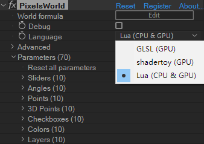

#运行Lua代码
---

切换语言为**Lua ( CPU & GPU )**





导入代码： 
```lua:hello.lua
version3()
a = 5+6
b = "PixelsWorld"
c = "is cool!"
d = time
e = slider(0)
f = "5 + 6 = " .. a .. "\nMessage : " .. b .. " " .. c .. "\nCurrent time is : " .. d .. " (s)\nValue of slider0 is : " .. e
print(f)
```

> - ``` a..b ``` 将变量a与b合并为字符串。
> - [```print()```](FuncList.md#print) 在屏幕上渲染信息。
> - [```slider()```](LinkParameters.md) 获取指定参数值。
> - 您可以在每行的末尾添加 ```;``` 非必须。Lua会将`\ n`（换行符）视为一段代码的结束标记。

您最终会在屏幕的左上角看到输出信息。

<br><br><br><br><br><br><br><br><br><br>

