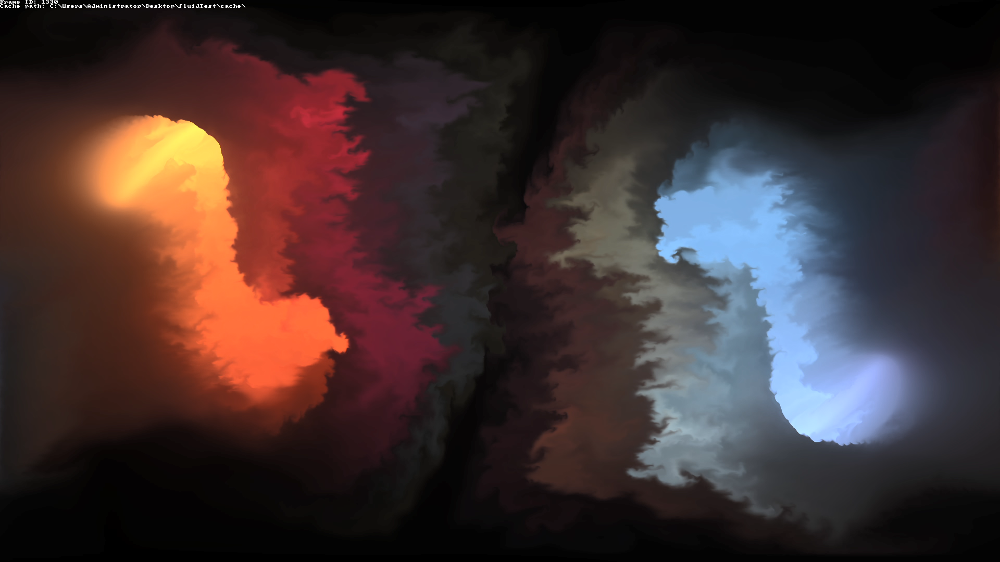
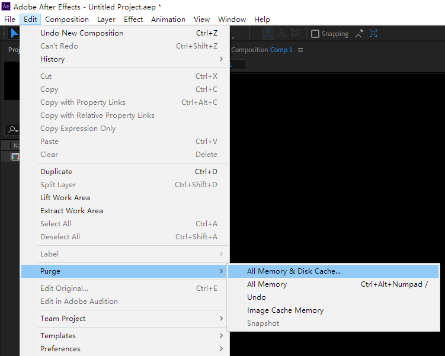
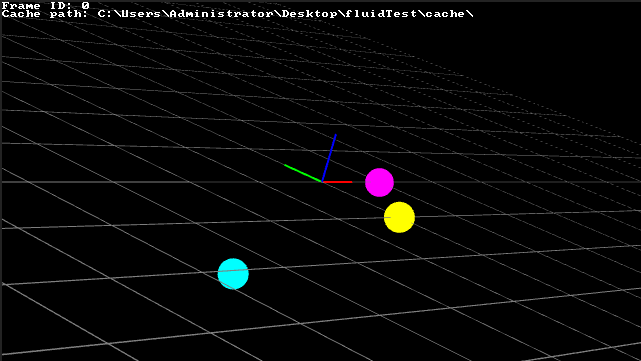

# 物理模拟
---


> 下图是[由nimitz制作的Chimera's Breath](https://www.shadertoy.com/view/4tGfDW)在PixelsWorld中运行的结果。[查看完整视频](https://www.bilibili.com/video/BV1854y1p7Rv/)



本章将介绍如何在PixelsWorld中缓存数据。

<span style="color:red">注意：由于Ae功能有限，请严格遵循本手册制定的规范进行缓存。</span>

> - 请检查您拥有`v3.3.3+`版本的PixelsWorld
> - 本篇文章认为读者拥有一定的Ae操作和PixelsWorld代码的熟练度，若您还不熟悉PixelsWorld的使用，请进入前面的章节进行学习。
> - 我们推荐您关闭Ae的多核心渲染功能。

<!-- no toc --> 
- [物理模拟](#物理模拟)
  - [缓存数据](#缓存数据)
  - [缓存贴图](#缓存贴图)
  - [缓存数据实战——三体问题模拟](#缓存数据实战三体问题模拟)
  - [缓存贴图实战——康威生命游戏](#缓存贴图实战康威生命游戏)
  - [缓存贴图实战——流体模拟](#缓存贴图实战流体模拟)


## 缓存数据

在PixelsWorld中缓存数据需要遵循以下几步：

代码逻辑：
1. 设定缓存位置和缓存文件名称
2. 计算`frameId=time*fps`
3. 计算`lastFrameId=frameId-1`
4. 若`lastFrameId`小于0，前往5，否则前往6
5. 初始化数据，前往7
6. 读取本地存储的上一帧模拟数据文件，文件不存在时报错，否则前往7
7. 计算本帧模拟数据
8. 存储本帧模拟数据到本地

操作逻辑：
1. 将满足上述逻辑的代码写入PixelsWorld中
2. 将时间指示器移动到当前图层的最开始位置处
3. 清除Ae所有缓存（`Edit->Purge->All Memory & Disk Cache...` 如下图）
4. 按住`Ctrl+Alt`单击插件面板上的LOGO（这一步可选）
5. 敲击空格开始渲染（**不要跳着渲染**）

> 注意：遇到任何不如意的情况（报错、画面闪动等），都要重新执行第2~5步




## 缓存贴图


代码逻辑：
1. 若降采样（二分之一、四分之一模式），则报错
2. 设定缓存位置和缓存文件名称
3. 计算`frameId=time*fps`
4. 计算`lastFrameId=frameId-1`
5. 若`lastFrameId`小于0，前往5，否则前往6
6. 初始化数据，前往7
7. 读取本地存储的上一帧贴图文件，文件不存在时报错，否则前往7
8. 计算本帧贴图文件
9. 存储本帧贴图文件到本地

> 关于贴图操作，请看[贴图](./Texture.md)章节

操作逻辑：
1. 将满足上述逻辑的代码写入PixelsWorld中
2. 将插件面板中的设定`Advanced->Internal texture format`设为`Floating point 32bit x RGBA (HDR)`
3. 将时间指示器移动到当前图层的最开始位置处
4. 清除Ae所有缓存（`Edit->Purge->All Memory & Disk Cache...`）
5. 按住`Ctrl+Alt`单击插件面板上的LOGO（这一步可选）
6. 敲击空格开始渲染（**不要跳着渲染**）


## 缓存数据实战——三体问题模拟



```lua:the_three_body_problem.lua
version3()


-- 导入向量库
require("veclib") 


-- 设定缓存文件名称
local cacheFileName = "A" 


-- 声明检查文件是否存在的函数（函数摘自：https://stackoverflow.com/questions/4990990/check-if-a-file-exists-with-lua）
function file_exists(name)
    local f=io.open(name,"r")
    if f~=nil then io.close(f) return true else return false end
end


-- 计算当前帧序号并四舍五入取整
local frameId = math.floor(time * fps + .5)


-- 计算上一帧序号
local lastFrameId = frameId -1


-- 检查当前帧序号是否非负，若是负数报错。
assert(frameId >= 0, "FrameId not support")
-- 打印当前帧序号（这一行可以删掉）
println("Frame ID: " .. frameId)


-- 设定缓存文件夹（我这里用了aep工程所在文件夹旁边的cache文件夹作为目录，使用projectFolder前需要先保存工程）
local cachePath = projectFolder .. "cache\\"
-- 打印当前输出文件夹（这一行可以删掉）
println("Cache path: " .. cachePath)


-- 若本帧序号为0（也就是上一帧小于0）
if(lastFrameId < 0) then
    -- 初始化三个物体的位置和速度
    p1 = vec3(100,0,0)
    v1 = vec3(-0.1,-0.1,-0.5)
    p2 = vec3(0,-100,0)
    v2 = vec3(0,0.1,0)
    p3 = vec3(-100,0,-95)
    v3 = vec3(0.1,0,0.5)
else
    -- 检查上一帧缓存文件是否存在
    if(file_exists(cachePath .. cacheFileName .. "_" .. tostring(lastFrameId) .. ".txt")) then
        -- 读取本地存储的上一帧的数据
        lua(loadString(cachePath .. cacheFileName .. "_" .. tostring(lastFrameId) .. ".txt"))
    else 
        -- 不存在时报错
        error("Please go back to frame 0 to re-cache your comp")
    end
end

-- 开始进行物理模拟
center = vec3(width/2,height/2,0)

f1,f2,f3 = vec3(0),vec3(0),vec3(0)
r = 15

m1=8
m2=10
m3=5

dp12,dp13,dp23 = p1-p2,p1-p3,p2-p3

f1 = f1 + m1*m2/math.max(dot(dp12,dp12),1e-1) * (-dp12)
f2 = f2 + m1*m2/math.max(dot(dp12,dp12),1e-1) * (dp12)

f1 = f1 + m1*m3/math.max(dot(dp13,dp13),1e-1) * (-dp13)
f3 = f3 + m1*m3/math.max(dot(dp13,dp13),1e-1) * (dp13)

f2 = f2 + m3*m2/math.max(dot(dp23,dp23),1e-1) * (-dp23)
f3 = f3 + m3*m2/math.max(dot(dp23,dp23),1e-1) * (dp23)


v1 = v1 + f1*(1/m1)
p1 = p1 + v1

v2 = v2 + f2*(1/m2)
p2 = p2 + v2

v3 = v3 + f3*(1/m3)
p3 = p3 + v3

-- 物理模拟结束


-- 存储三个物体的位置和速度数据到本地
saveString(
    cachePath .. cacheFileName .. "_" .. tostring(frameId) .. ".txt",
    string.format([==[
        p1=vec3(%f,%f,%f);v1=vec3(%f,%f,%f);
        p2=vec3(%f,%f,%f);v2=vec3(%f,%f,%f);
        p3=vec3(%f,%f,%f);v3=vec3(%f,%f,%f);
        ]==],
        p1.x,p1.y,p1.z,v1.x,v1.y,v1.z,
        p2.x,p2.y,p2.z,v2.x,v2.y,v2.z,
        p3.x,p3.y,p3.z,v3.x,v3.y,v3.z
    )
)


-- 用当前的帧模拟数据绘制三个星球
dim3()

move(center.x,center.y,center.z)

-- 绘制坐标系和网格
coord()
grid()

-- 第一个星球
beginGroup()
move(p1.x,p1.y,p1.z)
fill(1,0,1)
ball(r)
endGroup()

-- 第二个星球
beginGroup()
fill(1,1,0)
move(p2.x,p2.y,p2.z)
ball(r)
endGroup()

-- 第三个星球
beginGroup()
fill(0,1,1)
move(p3.x,p3.y,p3.z)
ball(r)
endGroup()
```

## 缓存贴图实战——康威生命游戏


```lua:game_of_life.lua
version3()

-- 检查降采样
assert(width == ds_width and height == ds_height , "Downsample not support" )


-- 声明检查文件是否存在的函数（函数摘自：https://stackoverflow.com/questions/4990990/check-if-a-file-exists-with-lua）
function file_exists(name)
    local f=io.open(name,"r")
    if f~=nil then io.close(f) return true else return false end
 end


-- 计算当前帧序号并四舍五入取整
local frameId = math.floor(time * fps + .5)


-- 计算上一帧序号
local lastFrameId = frameId -1


-- 检查当前帧序号是否非负，若是负数报错。
assert(frameId >= 0, "FrameId not support")
-- 打印当前帧序号（这一行可以删掉）
println("Frame ID: " .. frameId)


-- 设定缓存路径
local cachePath = projectFolder .. "cache\\"
println("Cache path: " .. cachePath)


-- 检查是否是第一帧
if(lastFrameId < 0) then
    -- 初始化贴图
    lastTexA = newTex(width,height)
else
    -- 检查上一帧是否存在
    if(file_exists(cachePath .. "A_" .. tostring(lastFrameId) .. ".raw")) then
        -- 导入上一帧贴图
        lastTexA = loadRAW(cachePath .. "A_" .. tostring(lastFrameId) .. ".raw")
    else 
        error("Please go back to frame 0 to cache your comp")
    end
end


-- 设定渲染代码
local fragCode = [==[
// Definition from: https://en.wikipedia.org/wiki/Conway%27s_Game_of_Life
// MIT license (Free for study and business purpose)
// Code by ZzStarSound

const int dx[8] = int[](-1,0,1,1,1,0,-1,-1);
const int dy[8] = int[](1,1,1,0,-1,-1,-1,0);

bool fetchStatus(int ox, int oy)
{
    ivec2 iuv = ivec2(floor(uv*resolution.xy)) + ivec2(ox,oy);
    ivec2 res = ivec2(floor(resolution.xy));
    if(iuv.x >= res.x || iuv.x < 0 || iuv.y >=res.y || iuv.y<0) return false;
    return texelFetch(layer[0],iuv,0).x>.5;
}

// From https://thebookofshaders.com/10/
float random (vec2 st) {
    return fract(sin(dot(st.xy, vec2(12.9898,78.233)))* 43758.5453123);
}

void main(){
    if(time == 0.)
    {
        outColor = vec4(random(uv)>.5);
    }else{
        bool curstatus = fetchStatus(0,0);
        int roundCount = 0;
        for(int i = 0;i<8;i++){
            if(fetchStatus(dx[i],dy[i])) roundCount ++ ;
        }
        if(curstatus)
        {
            if(roundCount < 2 || roundCount > 3) outColor = vec4(0);
            else outColor = vec4(curstatus);
        }
        else
        {
            if(roundCount == 3) outColor = vec4(1);
            else outColor = vec4(0);
        }
    }
}
]==]


-- 把上一帧图片放到PARAM0位置处，这样glsl在layer[0]可以读取上一帧贴图
swapTex(PARAM0,lastTexA)


--渲染代码
glsl(fragCode)


-- 把上一帧图片放回自己的位置
swapTex(PARAM0,lastTexA)


-- 储存本帧贴图到本地
saveRAW(cachePath .. "A_" .. tostring(frameId) .. ".raw",OUTPUT)


```

## 缓存贴图实战——流体模拟


> - 注意：应[原作者](https://www.shadertoy.com/view/4tGfDW)代码证书要求，下面的代码仅供学习交流使用。请勿商用
> - 不要忘记把插件面板上的设定`Internal texture format`改成`Floating point 32 bit x RGBA (HDR)`。
> - <span style="color:red">请在着手模拟前确保您阅读了前文的操作说明！</span> [前去阅读>>>](#缓存贴图)
> - 把`Mipmap filter`设置成`NONE`可以提速。

```lua:fluid_simulation.lua
version3()

assert(width == ds_width and height == ds_height , "Downsample not support" )

function file_exists(name)
    local f=io.open(name,"r")
    if f~=nil then io.close(f) return true else return false end
 end

local frameId = math.floor(time * fps + .5)
local lastFrameId = frameId -1

assert(frameId >= 0, "FrameId not support")
println("Frame ID: " .. frameId)
local cachepath = projectFolder .. "cache\\"
println("Cache path: " .. cachepath)


if(lastFrameId < 0) then
    lastTexC = newTex(width,height)
    lastTexD = newTex(width,height)
    drawTo(lastTexC)
    background(0,0,0,1)
    drawTo(lastTexD)
    background(0,0,0,1)
    drawTo(OUTPUT)
else
    path_c = cachepath .. "C_" .. tostring(lastFrameId) ..".raw"
    path_d = cachepath .. "D_" .. tostring(lastFrameId) ..".raw"
    if(file_exists(path_c) and file_exists(path_d) ) then
        lastTexC = loadRAW(path_c)
        lastTexD = loadRAW(path_d)
    else 
        error("Please go back to frame 0 to cache your comp")
    end
end


local commonCode = [==[
//Chimera's Breath
//by nimitz 2018 (twitter: @stormoid)

/*
    The main interest here is the addition of vorticity confinement with the curl stored in
    the alpha channel of the simulation texture (which was not used in the paper)
    this in turns allows for believable simulation of much lower viscosity fluids.
    Without vorticity confinement, the fluids that can be simulated are much more akin to
    thick oil.
    
    Base Simulation based on the 2011 paper: "Simple and fast fluids"
    (Martin Guay, Fabrice Colin, Richard Egli)
    (https://hal.inria.fr/inria-00596050/document)

    The actual simulation only requires one pass, Buffer A, B and C are just copies 
    of each other to increase the simulation speed (3 simulation passes per frame)
    and Buffer D is drawing colors on the simulated fluid 
    (could be using particles instead in a real scenario)
*/

#define dt 0.15
#define USE_VORTICITY_CONFINEMENT
//#define MOUSE_ONLY

//Recommended values between 0.03 and 0.2
//higher values simulate lower viscosity fluids (think billowing smoke)
#define VORTICITY_AMOUNT 0.11

float mag2(vec2 p){return dot(p,p);}
vec2 point1(float t) {
    t *= 0.62;
    return vec2(0.12,0.5 + sin(t)*0.2);
}
vec2 point2(float t) {
    t *= 0.62;
    return vec2(0.88,0.5 + cos(t + 1.5708)*0.2);
}

vec4 solveFluid(sampler2D smp, vec2 uv, vec2 w, float time)
{
    const float K = 0.2;
    const float v = 0.55;
    
    vec4 data = textureLod(smp, uv, 0.0);
    vec4 tr = textureLod(smp, uv + vec2(w.x , 0), 0.0);
    vec4 tl = textureLod(smp, uv - vec2(w.x , 0), 0.0);
    vec4 tu = textureLod(smp, uv + vec2(0 , w.y), 0.0);
    vec4 td = textureLod(smp, uv - vec2(0 , w.y), 0.0);
    
    vec3 dx = (tr.xyz - tl.xyz)*0.5;
    vec3 dy = (tu.xyz - td.xyz)*0.5;
    vec2 densDif = vec2(dx.z ,dy.z);
    
    data.z -= dt*dot(vec3(densDif, dx.x + dy.y) ,data.xyz); //density
    vec2 laplacian = tu.xy + td.xy + tr.xy + tl.xy - 4.0*data.xy;
    vec2 viscForce = vec2(v)*laplacian;
    data.xyw = textureLod(smp, uv - dt*data.xy*w, 0.).xyw; //advection
    
    vec2 newForce = vec2(0);

    newForce.xy += 0.75*vec2(.0003, 0.00015)/(mag2(uv-point1(time))+0.0001);
    newForce.xy -= 0.75*vec2(.0003, 0.00015)/(mag2(uv-point2(time))+0.0001);
    
    
    data.xy += dt*(viscForce.xy - K/dt*densDif + newForce); //update velocity
    data.xy = max(vec2(0), abs(data.xy)-1e-4)*sign(data.xy); //linear velocity decay
    
    #ifdef USE_VORTICITY_CONFINEMENT
    data.w = (tr.y - tl.y - tu.x + td.x);
    vec2 vort = vec2(abs(tu.w) - abs(td.w), abs(tl.w) - abs(tr.w));
    vort *= VORTICITY_AMOUNT/length(vort + 1e-9)*data.w;
    data.xy += vort;
    #endif
    
    data.y *= smoothstep(.5,.48,abs(uv.y-0.5)); //Boundaries
    
    data = clamp(data, vec4(vec2(-10), 0.5 , -10.), vec4(vec2(10), 3.0 , 10.));
    
    return data;
}
]==]

local bufferACode = [==[

    float length2(vec2 p){return dot(p,p);}
    mat2 mm2(in float a){float c = cos(a), s = sin(a);return mat2(c,s,-s,c);}
    
    void mainImage( out vec4 fragColor, in vec2 fragCoord )
    {
        vec2 uv = fragCoord.xy/iResolution.xy;
        vec2 w = 1.0/iResolution.xy;
        
        vec4 data = solveFluid(iChannel0, uv, w, iTime);
        fragColor = data;
        
    }
]==]

local bufferBCode = [==[

    float length2(vec2 p){return dot(p,p);}
    mat2 mm2(in float a){float c = cos(a), s = sin(a);return mat2(c,s,-s,c);}
    
    void mainImage( out vec4 fragColor, in vec2 fragCoord )
    {
        vec2 uv = fragCoord.xy/iResolution.xy;
        vec2 w = 1.0/iResolution.xy;
        
        vec4 data = solveFluid(iChannel0, uv, w, iTime);
        fragColor = data;
        
    }
]==]

local bufferCCode = [==[

    float length2(vec2 p){return dot(p,p);}
    mat2 mm2(in float a){float c = cos(a), s = sin(a);return mat2(c,s,-s,c);}
    
    void mainImage( out vec4 fragColor, in vec2 fragCoord )
    {
        vec2 uv = fragCoord.xy/iResolution.xy;
        vec2 w = 1.0/iResolution.xy;
        
        vec4 data = solveFluid(iChannel0, uv, w, iTime);
        fragColor = data;
        
    }
]==]

local bufferDCode = [==[
    //Chimera's Breath
    //by nimitz 2018 (twitter: @stormoid)
    
    //see "Common" tab for fluid simulation code
    
    mat2 mm2(in float a){float c = cos(a), s = sin(a);return mat2(c,s,-s,c);}
    
    //shader incoming relating to this palette
    vec3 getPalette(float x, vec3 c1, vec3 c2, vec3 p1, vec3 p2)
    {
        float x2 = fract(x/2.0);
        x = fract(x);   
        mat3 m = mat3(c1, p1, c2);
        mat3 m2 = mat3(c2, p2, c1);
        float omx = 1.0-x;
        vec3 pws = vec3(omx*omx, 2.0*omx*x, x*x);
        return clamp(mix(m*pws, m2*pws, step(x2,0.5)),0.,1.);
    }
    
    vec4 pal(float x)
    {
        vec3 pal = getPalette(-x, vec3(0.2, 0.5, .7), vec3(.9, 0.4, 0.1), vec3(1., 1.2, .5), vec3(1., -0.4, -.0));
        return vec4(pal, 1.);
    }
    
    vec4 pal2(float x)
    {
        vec3 pal = getPalette(-x, vec3(0.4, 0.3, .5), vec3(.9, 0.75, 0.4), vec3(.1, .8, 1.3), vec3(1.25, -0.1, .1));
        return vec4(pal, 1.);
    }
    
    void mainImage( out vec4 fragColor, in vec2 fragCoord )
    {
        vec2 uv = fragCoord.xy / iResolution.xy;
        vec2 mo = iMouse.xy / iResolution.xy;
        vec2 w = 1.0/iResolution.xy;
        
        vec2 velo = textureLod(iChannel0, uv, 0.).xy;
        vec4 col = textureLod(iChannel1, uv - dt*velo*w*3., 0.); //advection
    
    
        col += .0025/(0.0005+pow(length(uv - point1(iTime)),1.75))*dt*0.12*pal(iTime*0.05 - .0);
        col += .0025/(0.0005+pow(length(uv - point2(iTime)),1.75))*dt*0.12*pal2(iTime*0.05 + 0.675);
        
        
        if (iFrame < 20)
        {
            col = vec4(0.);
        }
        
        col = clamp(col, 0.,5.);
        col = max(col - (0.0001 + col*0.004)*.5, 0.); //decay
        
    
        fragColor = col;
        
    }
    
]==]

local mainCode = [==[
    void mainImage( out vec4 fragColor, in vec2 fragCoord )
    {
        vec4 col = textureLod(iChannel0, fragCoord/iResolution.xy, 0.);
        fragColor = col;
    }
]==]


local texA,texB,texC=newTex(width,height),newTex(width,height),newTex(width,height)

swapTex(PARAM0,lastTexC)
shadertoy(commonCode .. bufferACode)
swapTex(PARAM0,lastTexC)
castTex(texA,OUTPUT)


swapTex(PARAM0,texA)
shadertoy(commonCode .. bufferBCode)
swapTex(PARAM0,texA)
castTex(texB,OUTPUT)

swapTex(PARAM0,texB)
shadertoy(commonCode .. bufferCCode)
swapTex(PARAM0,texB)
castTex(texC,OUTPUT)
saveRAW(cachepath .. "C_" .. tostring(frameId) ..".raw",texC)

swapTex(PARAM0,texA)
swapTex(PARAM1,lastTexD)
shadertoy(commonCode .. bufferDCode)
swapTex(PARAM0,texA)
swapTex(PARAM1,lastTexD)
saveRAW(cachepath .. "D_" .. tostring(frameId) ..".raw",OUTPUT)

```
