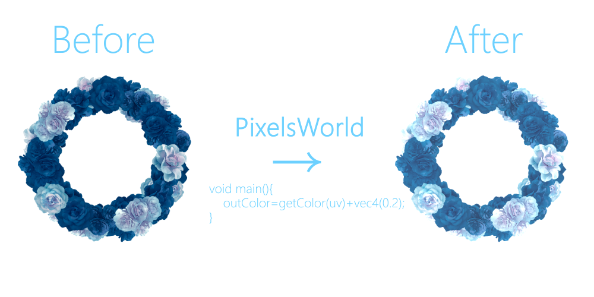
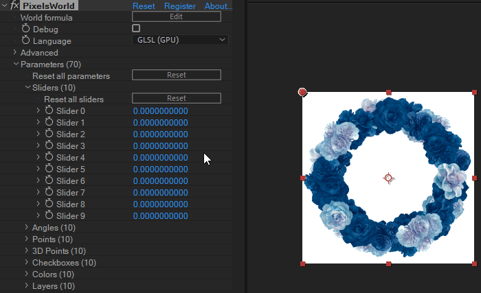
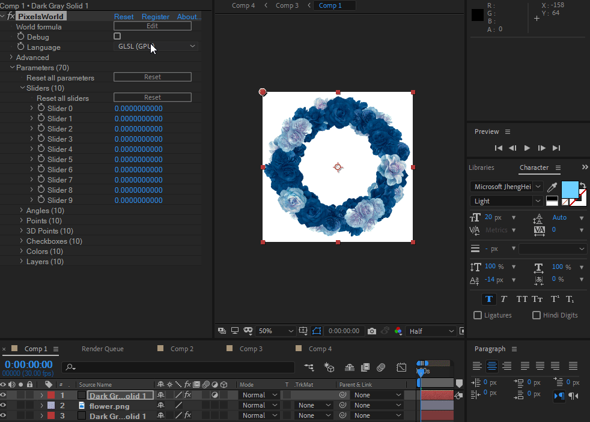

## シェーダーコードを書くとはどんな感じ？
シェーダーコードは、*Excelの表計算機能のようなもの*です。表に数式を入力すると、表がすべてのデータを処理してくれます。

もし表のデータを入力ピクセルとし、計算後の表を出力ピクセルと考えると、**ピクセルの世界のコードはExcelの表計算式と同じように理解できます。**

## 使用例：画像を明るくする
画像を明るくする最も簡単な方法は、すべてのピクセルの赤、緑、青の数値を上げることです。Excelの表計算では、次の手順を行う必要があります：


これで、左側のすべてのピクセルデータを「明るく」できます。

ピクセルの世界に変えると、次のコードを入力する必要があります：

```glsl:bright_describe.shader
outColor=getColor(uv)+vec4(0.2);
```

つまり、現在の位置（*uv*）の入力ピクセルを取得し（*getColor*）、その4つのチャネル（赤、緑、青、透明）に0.2を加え（*+vec4(0.2)*）、計算結果を出力（*outColor*）に送ります（*=*）。

もちろん、この一行だけではピクセルの世界は正常に動作しないので、**外側には「シェル」を1つ被せる必要があります**。完全なコードは次のようになります：
```glsl:bright.shader
void main(){
    outColor=getColor(uv)+vec4(0.2);
}
```
### 操作方法：


### 入力画像（右クリックして保存）：


（[元の作者リンク](https://www.pixiv.net/artworks/75891619)）

### 効果図：




### さらにコントロールを追加！
もちろん、単に0.2を加えるだけでは私たちが望む結果にはなりません。もっと制御可能にしたい場合は、`0.2`を`slider[0]`に置き換えることで、パネルのスライダーを使って効果を調整できます。
```glsl:bright_control.shader
void main(){
    outColor=getColor(uv)+vec4(slider[0]);
}
```



しかし、もし値が負の場合、透明度も小さくなることに気づくでしょうが、通常透明度を変更したくないため、そのチャンネルを避ける必要があります。そうすると、レンダリングコードは次のように書く必要があります：
```glsl:bright_control.shader
void main(){
    vec4 inColor = getColor(uv);
    inColor.rgb = inColor.rgb + vec3(slider[0]);
    outColor = inColor;
}
```
> 説明：まず入力ピクセルを4次元(*vec4*)変数`inColor`に一時保存し、それからrgb（赤緑青）3つのチャネルに`slider[0]`の数値を加えます。最後に`inColor`の値を`outColor`に渡します。これにより、`inColor`のaチャネル（透明チャネル）はそのまま出力に送られます。


### パラメータに名前を付ける
次の操作で、パラメータパネルを整理整頓されたものにすることができます：




### プリセットに保存
最後に、作成したコードを保存して、特に後で使うかもしれないコードをプリセットに保存することができます。詳細については、[プリセット管理](../Editor/SavePresets.md)セクションを参照してください。


## おめでとうございます！

あなたはピクセルの世界の基本的な使用方法を習得しました！

ピクセル世界ではコードを書くことができる以外に、[shadertoy](https://www.shadertoy.com/)のサイトから面白いエフェクトを探し出して、ピクセル世界に持ち込むこともできます。shadertoyからのコードのレンダリング方法については、[こちら](shadertoy.md)を参照してください。


<br>
<br>
<br>
<br>
<br>
<br>
<br>