# Function List
--- 

This page covers all functions provided in Lua render mode. 

**Required functions**

[version3](#version3)

**Parameter link functions**

[slider](LinkParameters.md),
[angle](LinkParameters.md),
[point](LinkParameters.md),
[point3d](LinkParameters.md),
[checkbox](LinkParameters.md),
[color](LinkParameters.md),
[layer](LinkParameters.md)

**Print message functions**

[print](#print),
[println](#println),
[alert](#alert)

**Transform functions**

[move](#move),
[scale](#scale),
[rotate](#rotate),
[rotateX](#rotatex),
[rotateY](#rotatey),
[rotateZ](#rotatez),
[twirl](#twirl)

[beginGroup](#begingroup),
[endGroup](#endgroup),
[beginGlobal](#beginglobal),
[endGlobal](#endglobal)

[global2local](#global2local),
[local2global](#local2global),
[global2screen](#global2screen),
[screen2global](#screen2global)

[getTransformMatrix](#gettransformmatrix)

**Draw functions**

> Primitives

[tri](#tri),
[quad](#quad),
[rect](#rect),
[circle](#circle),
[ellipse](#ellipse),
[par](#par),
[line](#line)

[cube](#cube),
[tet](#tet),
[cone](#cone),
[ball](#ball),
[tube](#tube)

[image](#image),
[imageAlign](#imagealign),
[imageAnchor](#imageanchor)

[text](#text),
[textSize](#textsize),
[textFont](#textfont),
[textAlign](#textalign),
[textAnchor](#textanchor),
[textAlignOuter](#textalignouter),
[textInterval](#textinterval),
[textAdvanceScale](#textadvancescale)

[coord](#coord),
[grid](#grid)

[poly](Poly.md),
[setPoly](#setpoly)

[background](#background),
[in2out](#in2out) 

> Attribute controls

[dim2](#dim2),
[dim3](#dim3)

[perspective](#perspective),
[noPerspective](#noperspective)

[fill](#fill),
[noFill](#nofill),
[stroke](#stroke),
[noStroke](#nostroke),
[dot](#dot),
[noDot](#nodot)

[wireframe](#wireframe),
[noWireframe](#nowireframe)

[blendAlpha](#blendalpha),
[noBlendAlpha](#noblendalpha)

[back](#back),
[noBack](#noback)

[pure](#pure),
[phong](#phong),
[anime](#anime)

[rgba](#rgba),
[depth](#depth),
[normal](#normal)

[setDepth](#setdepth)

> Lights

[ambientLight](#ambientlight),
[pointLight](#pointlight),
[parallelLight](#parallellight)

[clearLight](#clearlight),
[getLight](#getlight)  

> Camera function

[aeCamera](#aecamera),
[lookAt](#lookat),
[viewSpace](#viewspace)  

> Stroke details

[strokeWidth](#strokewidth),
[strokeDivision](#strokedivision),
[strokeGlobal](#strokeglobal),
[strokeLocal](#strokelocal)  

> Dot details

[dotRadius](#dotradius),
[dotDivision](#dotdivision),
[dotGlobal](#dotglobal),
[dotLocal](#dotlocal) 

> Output details

[smooth](#smooth),
[noSmooth](#nosmooth) 

**Texture operations**

[newTex, delTex, getSize, swapTex, drawTo, castTex, blendTex, copyTex, savePNG, loadPNG, saveEXR, loadEXR, rotateTex, flipTex, resizeTex, trimTex](Texture.md)


**Utility tools**

[r2d](#r2d),
[d2r](#d2r)

[map](#map)
[clamp](#clamp)
[step](#step)
[smoothStep](#smoothstep)
[bezier](#bezier)

[rgb2hsl,hsl2rgb,rgb2hsv,hsv2rgb,rgb2cmy,cmy2rgb,rgb2cmyk,cmyk2rgb,cmy2cmyk,cmyk2cmy,hsl2hsv,hsv2hsl](#color-conversion)

[utf8ToLocal](#utf8tolocal),
[localToUtf8](#localtoutf8)

[getGLInfo](#getglinfo),
[getDrawRecord](#getdrawrecord),
[getStatus](#getstatus)

[getAudio](#getaudio)  

[loadString](#loadstring)
[saveString](#savestring)

**Read/Write pixels functions**

[getColor](#getcolor),
[setColor](#setcolor),
[getSize](#getsize),


**Run code functions**

[shadertoy](#shadertoy),
[glsl](#glsl),
[cmd](#cmd),
[lua](#lua),
[runFile](#runfile),
[txt](#txt)  

---
<br><br><br><br><br>
# Detailed descriptions

## version3

`version3()` function must be called in the first line. It put all functions in the table `pw3` to the global field. If you don't call it, you need to add a `pw3.` prefix to all the functions provided by PixelsWorld. For instance, the following demonstrated function `print()` should be `pw3.print()`. On the contrary, If you call the function `version3()` in the first line, the `pw3.` prefix could be omitted. This function is designed for backward compatibility. We recommend calling `version3()` in the first line any time you use Lua render mode. 

```lua:version3.lua
version3()
println("Hello PixelsWorld! ")
```

```lua:without_version3.lua
pw3.println("Hello PixelsWorld! ")
```

## print

`print(str)`,`print(str,brightness)`,`print(str,r,g,b)`,`print(str,r,g,b,a)` prints message to the left top corner of your scene. 


```lua:print.lua
version3()
print("Hello PixelsWorld! ")
str = "Hello, I am colorful PixelsWorld! "
for i=1,#str do
local c = str:sub(i,i)
local phase = math.sin(i/#str*TPI + time*10) / 2 + .5
print(c,phase,1-phase,1,1)
end
```

## println

`println(str)`,`println(str,brightness)`,`println(str,r,g,b)`,`println(str,r,g,b,a)` prints message to the left top corner of your scene, this function adds `\n` in the end of input string. 


```lua:println.lua
version3()
println("Hello PixelsWorld! ")
str = "Hello, I am colorful PixelsWorld! "
for i=1,#str do
local c = str:sub(i,i)
local phase = math.sin(i/#str*TPI + time*10) / 2 + .5
-- println(c,phase,1-phase,1,1)
print(c,phase,1-phase,1,1)
end
```

## alert

`alert(str)` prints **caution** message, equals to `println(str,1,1,0,1)`

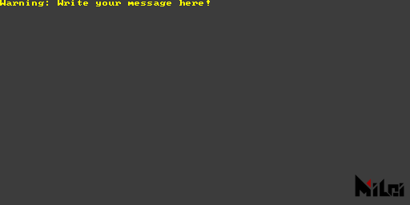

```lua:alert.lua
version3()
alert("Warning: Write your message here! ")
```

## move

`move(x,y)`,`move(x,y,z)`moves Paintbrush. 

> All transforms are done basing on the Paintbrush coordinate. 

Example: 

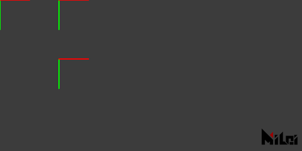


```lua:move.md
version3()
coord() -- show Paintbrush coordinate
move(100,0)
coord() -- show Paintbrush coordinate
move(0,100)
coord() -- show Paintbrush coordinate
```
Finally, the Paintbrush is located at `(100,100,0)`. 

## scale

`scale(ratio)`,`scale(x,y)`,`scale(x,y,z)`scales the Paintbrush coordinate. 

> All transforms are done basing on the Paintbrush coordinate. 


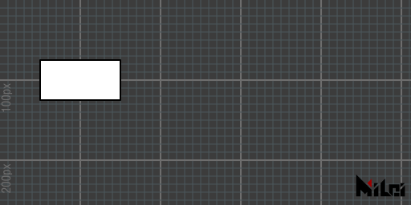

```lua:scale.lua
version3()
move(100,100)
scale(2)
rect(50,25)
```
--- 


```lua:no_scale.lua
version3()
move(100,100)
--scale(2)
rect(50,25)
```

## rotate
## rotateX
## rotateY
## rotateZ

`rotate(theta)`rotates Paintbrush with `theta` radians. `rotateX(theta)` rotates Paintbrush along X axis. `rotate(theta)` equals to `rotateZ(theta)`. 
> All transforms are done basing on the Paintbrush coordinate. 
> - If you are not familiar with radians, use `d2r(degree)` to convert a degree to a radian. For example：`rotate(d2r(90))` means rotate 90 degrees. 


```lua:rotate_degree.lua
version3()
move(100,100)
rotate(d2r(45))
rect(50,25)
```
---


```lua:rotate_radian.lua
version3()
move(100,100)
rotate(PI/4)
rect(50,25)
```
---


```lua:rotateX.lua
version3()
dim3()
move(100,100)
grid()
coord()
rotateX(d2r(45))
cube(50,25,10)
```
---


```lua:rotateY.lua
version3()
dim3()
move(100,100)
grid()
coord()
rotateY(d2r(45))
cube(50,25,10)
```

---

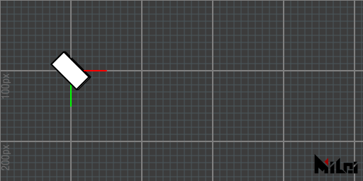

```lua:rotateZ.lua
version3()
dim3()
move(100,100)
grid()
coord()
rotateZ(d2r(45))
cube(50,25,10)
```


## twirl
`twirl(theta,x,y,z)` rotates Paintbrush along `(x,y,z)` axis with `theta` radians. For example, above-mentioned `rotateX(theta)` equals to `twirl(theta,1,0,0)`.
> All transforms are done basing on the Paintbrush coordinate. 
> - `twirl` is an matrix implementation of quaternion rotation. 


```lua:twirl.lua
version3()
dim3()
move(100,100)
grid()
coord()
stroke(1,1,0)
line(-50,-50,-50,50,50,50)
stroke(0,0,0)
twirl(d2r(90),1,1,1)
cube(50,25,10)
```

## beginGroup
## endGroup

1. `beginGroup()`,`endGroup()` pushes/pops a child transformation matrix to the world transformation stack. Transformations(`move,scale,rotate,twirl`) between `beginGroup()` and `endGroup()` will be canceled after `endGroup()`.
2. `beginGroup(mat)` pushes mat as a children transformation group (Use [getTransformMatrix](#gettransformmatrix) to get the transform matrix). 

> It equals to `pushMatrix()` and `popMatrix()` in Processing. 

Example: The following two code are equivalent. 


```lua:group.lua
version3()
for i = 1,6 do
    beginGroup()
    move(i*25,i*25)
    rotate(d2r(15*i))
    rect(25)
    endGroup()
end
```

---


```lua:without_group.lua
version3()
for i = 1,6 do
    move(i*25,i*25)
    rotate(d2r(15*i))
    rect(25)
    rotate(d2r(-15*i))
    move(-i*25,-i*25)
end
```

## beginGlobal
## endGlobal
Draw functions between `beginGlobal` and `endGlobal` will draw shapes in global coordinates. 


```lua:beginGlobal.lua
version3()
move(100,100)
fill(0,1,0) -- green
rect(50) -- Dran on (100,100,0)
beginGlobal()
fill(1,0,0) -- red
rect(50) -- Draw on (0,0,0)
endGlobal()
move(100,100)
fill(0,0,1) -- blue
rect(50) -- Draw on (200,200,0)
```

## global2local

`global2local(x,y,z)` converts a global point to a local point. Returns 3 doubles. 


```lua:global2local.lua
version3()
move(100,100)
rect(25)
move(0,50)
rotate(d2r(30))
coord()
x,y,z=global2local(100,100,0)
println("The local coordinate of the rectangle is:\n (" .. x .. ", " .. y .. ", " .. z .. ").")
```

## local2global

`local2global(x,y,z)` converts a local point to a global point. Returns 3 doubles. 


```lua:local2global.lua
version3()
move(100,100)
move(0,50)
rotate(d2r(30))
coord()
move(25,50)
rect(25)
x,y,z=local2global(0,0,0)
println("The global coordinate of the rectangle is:\n (" .. x .. ", " .. y .. ", " .. z .. ").")
```

## global2screen

`global2screen(x,y,z)` converts a global point to a screen point. Returns 3 doubles. 

> The result is affected by perspective mode. 


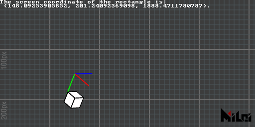

```lua:global2screen.lua
version3()
dim3()
move(100,100,0)
move(0,50,0)
rotateZ(d2r(30))
coord()
move(25,50,0)
cube(25)
x,y,z=global2screen(local2global(0,0,0))
println("The screen coordinate of the rectangle is:\n (" .. x .. ", " .. y .. ", " .. z .. ").")
```


## screen2global

`screen2global(x,y,z)` converts a screen point to a global point. Returns 3 doubles. 

> The result is affected by perspective mode. 


```lua:screen2global.lua
version3()
dim3()

x,y,z=screen2global(0,0,0)
println("The global coordinate of the camera is:\n (" .. x .. ", " .. y .. ", " .. z .. ").")
```

## getTransformMatrix

`getTransformMatrix()` returns a column major 4x4 transform matrix. 

> `mat[i][j]` returns the entry in `i`th column `j`th row. (`i`,`j`range: 1~4)


```lua:matrix.lua
version3()
dim3()

beginGroup()
move(width/3,height/3)
twirl(d2r(30),1,1,1)
cubetransform = getTransformMatrix()
endGroup()

beginGroup(cubetransform)
cube(50)
endGroup()
```


## tri
1. `tri(radius)` draws a regular triangle with radius `radius`, and the triangle will point to the positive direction of the Y-axis.
2. `tri()` equals to `tri(100)`
3. `tri(w,h)`draws a triangle with base length `w` and height `h`. 
4. `tri(p1x,p1y,p2x,p2y,p3x,p3y)` draws a triangle basing on 3 points `p1,p2,p3`.
5. `tri(p1x,p1y,p1z,p2x,p2y,p2z,p3x,p3y,p3z)` draws a triangle basing on 3 points `p1,p2,p3`. 

> - Add `dim3()` after `version3()`, and add a camera layer to your Ae comp to view the 3D triangle. 
> - The first 3 functions set normals to (0,0,-1) basing on the current Paintbrush coordinate. The last 2 functions calculate normals with formula: `cross(p1-p2,p3-p2)`.
> - `tri` is an abbreviation of `triangle`


```lua:tri1.lua
version3()
move(width/2,height/2)
tri(100)
```
---

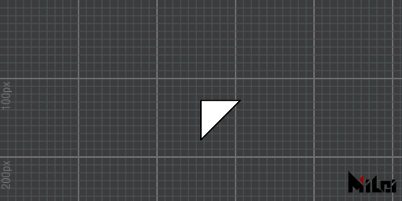

```lua:tri5.lua
version3()
dim3()
move(width/2,height/2)
tri(0,0,100,50,0,0,0,50,0)
```

## quad
1. `quad(p1x,p1y,p2x,p2y,p3x,p3y,p4x,p4y)`
1. `quad(p1x,p1y,p1z,p2x,p2y,p2z,p3x,p3y,p3z,p4x,p4y,p4z)`

> - Draws 2 triangles with order: `p1,p2,p3`,then `p1,p3,p4`.


```lua:quad.lua
version3()
move(200,100)
quad(0,0,75,0,50,40,0,15)
```

## rect

1. `rect(size)` draws a square with `size`. 
2. `rect()` equals to `rect(100)`
3. `rect(width,height)` draws a rectangle with width `width` and height `height`. 

> - The intersection point of the rectangle is at the origin of the Paintbrush coordinate.  
> - `rect` is an abbreviation of `rectangle`. 


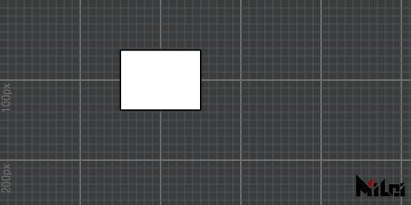

```lua:rect.lua
version3()
move(200,100)
rect(100,75)
```

## circle

1. `circle(radius)` draws a circle with radius `radius`. 
2. `circle()` equals to `circle(100)`
3. `circle(radius, div)` draws a circle with radius `radius`, and subdivision `div`. 

> Default subdivision: 128


```lua:circle.lua
version3()

move(100,100)
fill(1,0,0)
circle(25)

move(100,0)
fill(0,1,0)
circle(25,10)

move(100,0)
fill(0,0,1)
circle(25,3)
```

## ellipse
1. `ellipse(radiusx,radiusy)`draws an ellipse with x radius`radiusx`, y radius `radiusy`. 
2. `ellipse()` equals to `ellipse(100,100)`
3. `ellipse(radiusx,radiusy,div)` draws an ellipse with x radius`radiusx`, y radius `radiusy` and subdivision `div`.

> Default subdivision: 128


```lua:ellipse.lua
version3()

move(100,100)
fill(1,0,0)
ellipse(25,15)

move(100,0)
fill(0,1,0)
ellipse(25,15,10)

move(100,0)
fill(0,0,1)
ellipse(25,15,4)
```

## line

1. `line(p1x,p1y,p2x,p2y)` draws a line. 
1. `line(p1x,p1y,p1z,p2x,p2y,p2z)` draws a 3d line. 
1. `line()` equals to `line(0,0,0,100,100,100)`

> - Use `stroke(r,g,b)` to change the color. 
> - Use`strokeWidth(width)` to change the width. 
> - Use `noStroke()` to turn off line render, `stroke()` to turn on line render. 


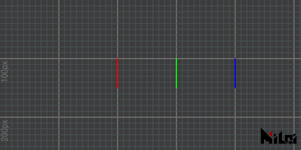

```lua:line.lua
version3()

move(200,100,0)
stroke(1,0,0)
line(0,0,0,50)

move(100,0,0)
stroke(0,1,0)
line(0,0,0,50)

move(100,0,0)
stroke(0,0,1)
line(0,0,0,50)
```
---


```lua:line_circle.lua
version3()
math.randomseed(1)
num = 32

move(width/2,height/2)

for i=1,num do
    beginGroup()
    rotateZ(d2r(360/num*i))
    strokeWidth(math.random()*3)
    line(0,0,100,0)
    endGroup()
end
```

## par

1. `par(x)` draws a point at`(x,0,0)`.
2. `par(x,y)` draws a point at`(x,y,0)`.
3. `par(x,y,z)` draws a point at`(x,y,z)`.
4. `par()` equals to `par(0,0,0)`

> - By default, the point rendering is turned off, use `dot()` to turn it on. You can call `noDot()` to turn it off again. 
> - `dotRadius(radius)` controls point radius. 
> - `dot(r,g,b)` controls point color. 
> - `dotGlobal()` makes point be avoid to be squeezed by `scale`. By default, points are rendered with `dotLocal()`.


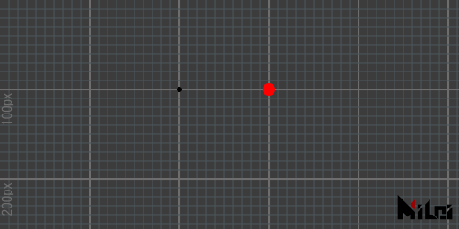

```lua:par.lua
version3()

dot()
dotRadius(3)
move(200,100)
par()

dot(1,0,0)
dotRadius(7)
move(100,0)
par()
```


## cube

1. `cube(size)` draws a cube with size `size`
1. `cube(sizex,sizey,sizez)` draws a cuboid with dimension `sizex,sizey,sizez`.
1. `cube()` equals to `cube(100)`
1. `cube()`

> Negative inputs or negative `scale()` would cause wrong normals. 


```lua:cube.lua
version3()
dim3()

move(200,100,0)
rotateY(d2r(30))
rotateX(d2r(30))
cube(40,25,10)
```

## tet 

1. `tet(radius)` draws a regular tetrahedron with radius `radius`. 
1. `tet()` equals to `tet(50)`
1. `tet(p1x,p1y,p1z,p2x,p2y,p2z,p3x,p3y,p3z,p4x,p4y,p4z)` draws tetrahedron basing on 4 points `p1,p2,p3,p4`.

> - The 3rd function generates normals basing on `tri` function and calls it with the following points order: `p1,p2,p3; p2,p1,p4; p3,p2,p4; p1,p3,p4.`. See also: [`tri`](#tri). 
> - `tet` is an abbreviation of `tetrahedron`. 


```lua:tet.lua
version3()
dim3()

move(200,100,0)
tet(0,0,0,
100,0,0,
0,100,0,
30,20,-50
)
```

## cone

1. `cone(size)` draws a cone with base circle radius `size` and height `2*size`.  
2. `cone()` equals to `cone(50)`. 
3. `cone(radius,height)` draws a cone with base circle radius `radius` and height `height`.
4. `cone(radius,height,div)` draws a cone with base circle radius `radius`, height `height` and subdivision `div`. 

> - Default subdivision: 64
> - If `sub` is greater than 16, the sidestroke and base point will be hidden. 
> Negative inputs or negative `scale()` would cause wrong normals. 


```lua:cone.lua
version3()
dim3()
move(100,100,0)

beginGroup()
rotateY(d2r(60))
cone(25)
endGroup()

move(100,0,0)
beginGroup()
rotateY(d2r(60))
noStroke()
cone(25)
endGroup()

move(100,0,0)
beginGroup()
rotateY(d2r(60))
stroke(1,0,0)
dot(1,1,0)
dotRadius(3)
cone(30,100,12)
endGroup()
```


## ball

1. `ball(radius)` draws a sphere with radius `radius`.
1. `ball()` equals to `ball(50)`. 
2. `ball(radius,level)` draw a ball with radius `radius` and subdivision level `level`. 

> - Default subdivision level 4. 
> - `level` must be non-negative. 
> - `level` 0 generates a regular octahedron. 
> - If `level` is greater than 2, the strokes and points will be hidden. 
> Negative inputs or negative `scale()` would cause wrong normals. 


```lua:ball.lua
version3()
dim3()
move(200,100,0)

beginGroup()
rotateY(d2r(60))
ball(25)
endGroup()

move(100,0,0)
beginGroup()
rotateY(d2r(60))
stroke(0,0.25,0.5)
dot(0,0.5,1)
dotRadius(3)
ball(30,2)
endGroup()
```


## tube

1. `tube(size)` draws a tube with base circle radius `size` and height `2*size`.
2. `tube()` equals to `tube(50)`
3. `tube(radius,height)`draws a tube with base circle radius `radius` and height `height`.
4. `tube(radius1,radius2,height)` draws a tube with close base circle radius `radius1`, far base circle radius `radius2` and height `height`.
5. `tube(radius1,radius2,height,div)` can change the subdivision. 
6. `tube(radius1,radius2,height,div,needMesh)` can change render 2 base circles or not. 
7. `tube(radius1,radius2,height,div,needMesh1,needMesh2)` can change render 2 base circles or not separately. 

> - Default `div`: 64. 
> - `needMesh` is `true` by default. 
> - If `div` is greater than 16, the side strokes and the base points will be hidden. 
> Negative inputs or negative `scale()` would cause wrong normals. 


```lua:tube.lua
version3()
dim3()
move(200,100,0)

beginGroup()
rotateY(d2r(60))
tube(25)
endGroup()

move(100,0,0)
beginGroup()
rotateY(d2r(60))
stroke(1,0.25,0.5)
dot(0,0,1)
dotRadius(3)
tube(30,25,50,8)
endGroup()
```

## image

1. `image(id,width,height)` draws an image with width `width` and height `height`. 

> - `id` is texture id,`PARAM0`~`PARAM9`means texture load from the layer parameters, `INPUT` means input image, `OUTPUT` means output image. 
> - If `id` is `OUTPUT`, it will be slow because we need to take a screenshot of your scene. 
> - The difference with `in2out(id)` is, `image(id, width, height)` draws a rectangle with a texture, which could interact with the depth buffers, where `in2out(id)` just copy pixels from one texture to another. This also means the image that is drawn to the screen is inverted by default (The default coordinate system of Ae is Y axis downward), so you may need `rotateX(PI)` to fix it. (And we don't recommend calling `scale(1,-1)`, which may cause wrong normals problem. 

Example: 


```lua:render_image.lua
version3()
dim3()
move(width/2,height/2)
twirl(d2r(45),-1,1,0)
beginGroup()
rotateX(d2r(180))
image(INPUT,width,height)
endGroup()
twirl(d2r(60),1,1,1)
cube()
```

## imageAlign

> New in `v3.3.0`

`imageAlign(rule)` changes the image orientation rendered by `image` function. The syntax of `rule` is as follows
- `rule` is a 4-length-string. 
- 1st char should be `+` or `-`
- 2nd char should be one of `x,y,z`
- 3rd char should be `+` or `-`
- 4th char should be one of `x,y,z`


`rule` represents which painter coordinates the texture UV coordinate (the origin is left bottom corner) should align with. By default, the `rule` is `"+x+y"`, it represents u aligns with positive x, v aligns with positive y. 


```lua:imageAlign.lua
version3()
dim3()

move(100,100,0)
coord()
image(PARAM0,128,128)

move(150,0,0)
coord()
imageAlign("+x-y")
image(PARAM0,128,128)

move(150,0,0)
coord()
imageAlign("+z-y")
image(PARAM0,128,128)
```

## imageAnchor

> New in `v3.5.0`. 

- `imageAnchor(u,v)` specifies the uv position of the anchor point of the image. 
- `imageAnchor(a)` is a shortcut of `imageAnchor(a,a)`


## text

> New in `v3.5.0`

`text(str)` renders text onto the screen. 


```lua:text.lua
version3()
move(width/2,height/2)
textAlign("+x-y")
text("Hello PixelsWorld!")
```

By the way, the following functions can control the style of the text. 

- Fill color: [fill(r,g,b)](#fill)
- Stroke color: [stroke(r,g,b)](#stroke)
- Fill off: [noFill()](#nofill)
- Stroke off[noStroke()](#nostroke)
- Stroke width: [strokeWidth(width)](#strokewidth)
- Font: [textFont(fontFileName)](#textfont)
- Size of text: [textSize(size)](#textsize)
- Intervals of text: [textInterval(dx,dy)](#textinterval)
- Advance scaling: [textAdvanceScale(rx,ry)](#textadvancescale)

## textSize

> New in `v3.5.0`

- `textSize(size,resolution)` set the text size to be rendered. `size` controls the size of the text, `resolution` controls the resolution of the text. 
- `textSize(size)` equals to `textSize(size,size)`

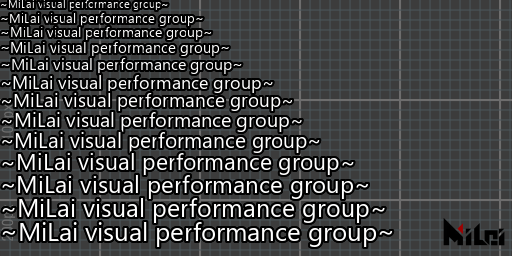

```lua:textSize.lua
version3()
textAlign("+x-y")
textAnchor(0,1)
for i=1,13 do
    local sz = i  + 8
    textSize(sz)
    text("~MiLai visual performance group~")
    move(0,sz + 4)
end
```

## textFont

> New in `v3.5.0`

- `textFont(fontFileName)` set the font of the text to be rendered. `fontFileName` is the font-file's name located in `C:\Windows\Fonts`. (Right click the file, click Properties, you would see the font-file's name. E.g.: `textFont("arial.ttf")`)。

> You can also use the full path of a font. Yes, you can load font files in everywhere. (`textFont([[D:\MyFolder\arial.ttf]])`)


```lua:textFont.lua
version3()

textAlign("+x-y")
textAnchor(0,1)
textSize(20)

font_list={
{"arial.ttf","The quick brown fox jumps over the lazy dog. "},
{"MATURASC.TTF","The quick brown fox jumps over the lazy dog. "},
{"KUNSTLER.TTF","The quick brown fox jumps over the lazy dog. "},
{"msmincho.ttc","色は匂へど　散りぬるを"},
{"UDDigiKyokashoN-R.ttc","我が世誰ぞ　常ならむ"},
{"STXINGKA.TTF","人生得意须尽欢 莫使金樽空对月"},
{"msjh.ttc","山氣日夕佳 飛鳥相與還"},
{"simsun.ttc","吥葽 莣記莪、伱知道 莪 拿起伱 就 倣吥丅。"},
{"STZHONGS.TTF","○●対沵倾注ㄋ珴所侑旳温柔︶ㄣ"},
}

for i=1,#font_list do
textFont(font_list[i][1])
text(font_list[i][2])
move(0,28)
end
```

## textAlign 

> New in `v3.5.0`

`textAlign(rule)` sets the alignment rule of the text. 

[See also imageAlign>>>](#imagealign)


## textAnchor 

> New in `v3.5.0`

`textAnchor(x,y)` sets the anchor point of the text. 

[See also imageAnchor>>>](#imageanchor)

## textAlignOuter

> New in `v3.5.0`

`textAlignOuter(flag)` set if we align text with outer boundary of the text.  `flag` is a bool. 

## textInterval

> New in `v3.5.0`

`textInterval(x,y)` set the intervals of the text texture. Default: `x:0, y:0`


## textAdvanceScale

> New in `v3.5.0`

`textAdvanceScale(rx,ry)` set the scale of advances. Default: `rx:1, ry:1`


## coord

`coord()` draws the current Paintbrush coordinate. 


```lua:coord.lua
version3()

move(100,100)
coord()

move(150,0)
coord()

rotate(d2r(30))
move(50,0)
scale(2,1)
coord()
```

## grid 

`grid()` draws a grid with many 100x100px squares. 


```lua:grid.lua
version3()

move(width/2,height/2)
rotate(d2r(30))
grid()
```

## setPoly

`setPoly(obj)` analyzes obj only, use `poly()` to draw the previous set obj to scene. 

> - It will be efficient in the case you draw the same obj for many times. 
> - See also [Poly](Poly.md)

## background

`background(brightness)`,`background(r,g,b)`,`background(r,g,b,a)` draws a pure color rectangle to scene.

> - Notes: This function overrides all shapes you drew before. 


```lua:background.lua
version3()

background(1,1,0)
```

## in2out

1. `in2out(id)` set the `id` texture to the scene. 
2. `in2out()` equals to `in2out(INPUT)`

> `id` range: `PARAM0`~`PARAM9` or `INPUT`. 


## dim2

`dim2()` set the scene to 2D mode. The 2D mode is on by default, you usually no need to call it. 

> In PixelsWorld, a 2D scene means a 3D scene without depth test and perspective. 

## dim3

`dim3()` set the scene to 3D mode. Call it immediately after `version3()`. 

> Note: Use [`viewSpace`](#verspace) to change the far plane dimension if your layer size is not equal to the comp size. Otherwise, the shapes in 3D mode will be rendered to an unexpected position. 

## perspective

`perspective()` set the scene to perspective mode, everything looks small in the distance and big on the contrary. Use [viewSpace](#viewspace) to change the camera information. Use [lookAt](#lookat) to set the location of the camera. 

> Perspective mode is on by default after calling `dim3()`. 

## noPerspective

`noPerspective()` set the scene to orthogonal mode. 


```lua:noPerspective.lua
version3()

dim3()
n = 20
move(100,100,0)
beginGroup()
rotateX(d2r(85))
for i=1,n do
    move(0,300,0)
    fill(i/n,1-i/n,1)
    cube(50)
end
endGroup()

move(300,0,0)
noPerspective()
beginGroup()
rotateX(d2r(85))
for i=1,n do
    move(0,300,0)
    fill(i/n,1-i/n,1)
    cube(50)
end
endGroup()
```

## fill

1. `fill()` turns on fill mode. 
1. `fill(brightness)`,`fill(r,g,b)`,`fill(r,g,b,a)` turns on fill mode and set fill color.

> - Note: If you set `Alpha` smaller than 1, render far object first, or you will get wrong render results due to the depth test. (This is a feature of OpenGL render)

## noFill

`noFill()` turns off the fill mode.


```lua:fill.lua
version3()

move(200,100,0)
fill(1,0,0)
rect(50)

move(100,0,0)
fill(1,1,0)
rect(50)

move(100,0,0)
noFill()
rect(50)
```

## stroke

1. `stroke()` turns on the stroke mode. 
1. `stroke(brightness)`,`stroke(r,g,b)`,`stroke(r,g,b,a)` turns on stroke mode and set the stroke color. 

## noStroke

`noStroke()` turns off stroke mode. 

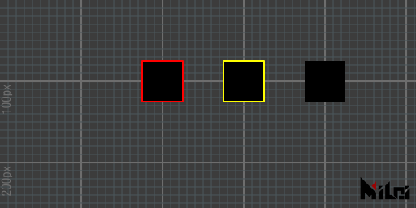

```lua:stroke.lua
version3()

fill(0)
move(200,100,0)
stroke(1,0,0)
rect(50)

move(100,0,0)
stroke(1,1,0)
rect(50)

move(100,0,0)
noStroke()
rect(50)
```


## dot

1. `dot()` turns on the dot mode. 
2. `dot(brightness)`,`dot(r,g,b)`,`dot(r,g,b,a)` turns on the dot mode and set the dot color. 

## noDot

`noDot()` turns off the dot mode. 


```lua:dot.lua
version3()

fill(1)
move(200,100,0)
stroke(1,0,0)
rect(50)

move(100,0,0)
dot(1,1,0)
rect(50)

move(100,0,0)
noDot()
rect(50)
```

## wireframe

`wireframe()` turns on the wireframe mode.

## noWireframe

`noWireframe()` turns off the wireframe mode.

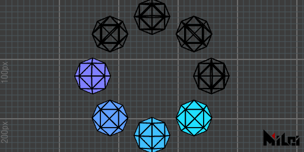

```lua:wireframe.lua
version3()
n=8
dim3()

move(width/2, height/2)
for i=1,n do
    if i>n//2 then wireframe()
    else noWireframe() end
    beginGroup()
    rotateZ(d2r(i*360/n))
    move(100,0,0)
    fill(i/n,1-i/n,1)
    ball(30,1)
    endGroup()
end
```

## blendAlpha

`blendAlpha()` turns on the alpha blending. 

## noBlendAlpha

`noBlendAlpha` turns off the alpha blending. 


```lua:blendAlpha.lua
version3()
castTex(OUTPUT,INPUT)

move(200,100,0)
fill(1,0,0,0.2)
rect(80)

move(100,0,0)
noBlendAlpha()
fill(1,0,0,0.2)
rect(80)
```

## back

`back()` If the fill alpha is smaller than 1, back mode shows the backside of an obj. Off by default. 

## noBack

`noBack()` turn off back mode. 


```lua:back.lua
version3()
dim3()
fill(1,0,0,0.2)

rotateX(d2r(30))
rotateY(d2r(-15))
move(200,180,0)
cube(80)

move(150,0,0)
back()
cube(80)
```

## pure

`pure()` use pure color to render. On by default. 

> anime, phong, pure are 3 dependent mode, turn on one may turn off the other two. 

## phong

1. `phong(ambient,diffuse,specular,specularPower)` turns on the phong render mode, and set the ambient strength to `ambient`, diffuse strength to `diffuse`, specular strength to `specular`, specular damping power to `specularPower`. 
2. `phong()` only turn on the phong render mode, it doesn't change the configs. 

> - By default, there is no light in the scene, call [getLight()](#getlight), [ambientLight()](#ambientlight), [parallelLight()](#parallellight), [pointLight](#pointlight) to add lights. 
> - If you are sure there are lights in your scene but the obj is black, call [normal](#normal) to check if the normal is right. 
> - Default settings: ambient:1,diffuse:1,specular:1,specularPower:1. 
> - anime, phong, pure are 3 dependent mode, turn on one may turn off the other two. 
> - Call [dim3()](#dim3) before calling this function. 


```lua:phong.lua
version3()
dim3()

move(width/2,height/2,0)

grid()
coord()

n=10

beginGroup()
move(0,0,-100)
pointLight()
endGroup()

for i=1,n do
    beginGroup()
    rotateZ(d2r(i*360/n))
    move(100,0,0)
    fill(i/n,1-i/n,1)
    if(i<=n//2) then pure()
    else phong() end
    ball(25)
    endGroup()
end
```

## anime

1. `anime(ambient,diffuse,specular,specularPower,diffuseThreshold,specularThreshold)`
1. `anime()` turns on the anime render mode. 

> - anime render mode is based on [phong](#phong), hence the first 4 arguments `ambient,diffuse,specular,specularPower` are same with phong render mode. `diffuseThreshold` configs the diffusion threshold, if diffuse lightnees in a pixel is bigger than threshold, it will be white. Otherwise it will be dark. `specularThreshold` is threshold of specular. 
> - The anime render mode smooth the light-dark border when you turn on the smooth settings in plugin panel. 
> - Default settings: ambient:1,diffuse:1,specular:1,specularPower:1,diffuseThreshold:0.5,specularThreshold:0.8
> anime, phong, pure are 3 dependent mode, turn on one may turn off the other two. 
> - Call [dim3()](#dim3) before calling this function. 


```lua:anime.lua
version3()
dim3()

move(width/2,height/2,0)

grid()
coord()

n=10

beginGroup()
move(0,0,-100)
pointLight()
endGroup()

for i=1,n do
    beginGroup()
    rotateZ(d2r(i*360/n))
    move(100,0,0)
    fill(i/n,1-i/n,1)
    if(i<=n//2) then pure()
    else anime() end
    ball(25)
    endGroup()
end
```


## rgba

`rgba()`RGBA output mode, on by default.

> - rgba, depth, normal are 3 dependent mode, turn on one may turn off the other two. 
> - You can use `phong(),anime()` in this output mode. 


```lua:rgba.lua
version3()
dim3()
background(1)
move(width/2,height/2,0)

n=10

beginGroup()
move(0,0,-100)
pointLight()
endGroup()

rgba()
-- depth()
-- normal()

noStroke()
for x=1,n do
    for y=1,n do
        for z=1,n do
            beginGroup()
            fill(x/n,y/n,z/n)
            move(map(x,1,n,-n/2,n/2)*50,map(y,1,n,-n/2,n/2)*50,map(z,1,n,-n/2,n/2)*200)
            ball(10,2)
            endGroup()
        end
    end
end
```

## depth

`depth(blackDistance, whiteDistance)` depth output mode. Set pixels at distance `blackDistance` to black, pixels at distance `whiteDistance` to white. If they are the same, PixelsWorld sets the pixels nearer than the value you set to black, otherwise white.  

> - rgba, depth, normal are 3 dependent modes, turn on one may turn off the other two. 
> - `phong(),anime()` will be ignored in this output mode. 
> - Call [dim3()](#dim3) before calling this function. 


```lua:depth.lua
version3()
dim3()
background(1)
move(width/2,height/2,0)

n=10

beginGroup()
move(0,0,-100)
pointLight()
endGroup()

-- rgba()
depth()
-- normal()

noStroke()
for x=1,n do
    for y=1,n do
        for z=1,n do
            beginGroup()
            fill(x/n,y/n,z/n)
            move(map(x,1,n,-n/2,n/2)*50,map(y,1,n,-n/2,n/2)*50,map(z,1,n,-n/2,n/2)*200)
            ball(10,2)
            endGroup()
        end
    end
end
```

## normal

1. `normal(faceToCamera, normalize)` turns the normal output mode on, and configs faceToCamera and normalize. 
2. `normal(faceToCamera)` turns the normal output mode on, and configs faceToCamera. 
3. `normal()` only turns the normal output mode on. 

> - `faceToCamera` is a boolean, `true` means the normals are calculated based on camera location. `false` means the normals are calculated based on the global coordinate. 
> - `normalize` is a boolean. 
> - Default settings: faceToCamera:true, normalize:true.
> - rgba, depth, normal are 3 dependent modes, turn on one may turn off the other two. 
> - `phong(),anime()` will be ignored in this output mode. 
> - Call [dim3()](#dim3) before calling this function. 


```lua:normal.lua
version3()
dim3()
background(.5,.5,1)
move(width/2,height/2,0)

n=10

beginGroup()
move(0,0,-100)
pointLight()
endGroup()

-- rgba()
-- depth()
normal()

noStroke()
for x=1,n do
    for y=1,n do
        for z=1,n do
            beginGroup()
            fill(x/n,y/n,z/n)
            move(map(x,1,n,-n/2,n/2)*50,map(y,1,n,-n/2,n/2)*50,map(z,1,n,-n/2,n/2)*200)
            ball(10,2)
            endGroup()
        end
    end
end
```

## setDepth

`setDepth(id,blackDistance,whiteDistance)` reads the **red channel** of texture `id`, maps color basing on `blackDistance,whiteDistance` to the depth test buffer in the scene.

> - The depth sequence from other 3DCG software can be loaded into PixelsWorld through this function. Namely, the shapes can interact with the color sequence rendered from other 3DCG software. 
> - Call [dim3()](#dim3) before calling this function. 
> - Valid texture id: `INPUT`,`PARAM0`~`PARAM9`


## ambientLight

1. `ambientLight(r,b,g,intensity)`
1. `ambientLight()` equals to `ambientLight(1,1,1,1)`
1. `ambientLight(brightness)` equals to `ambientLight(brightness,brightness,brightness,1)`
1. `ambientLight(brightness,intensity)` equals to `ambientLight(brightness,brightness,brightness,intensity)`
1. `ambientLight(r,g,b)` equals to `ambientLight(r,b,g,1)`

> - Adds ambient light to the scene. Valid to all objs. 
> - Objs are lit up by this kind of light even if they have wrong normals. 


```lua:al.lua
version3()
dim3()
move(width/2,height/2,0)

n=4

phong()

ambientLight(1,0.5,0.2,10)

noStroke()

for r=1,n do
    local ra = r*50
    local cn = math.floor(ra*TPI/40)
    for i=1,cn do
        beginGroup()
        rotateZ(d2r(i/cn*360))
        fill(hsl2rgb(i/cn,0.5,0.5))
        move(ra,0,0)
        ball(15,3)
        endGroup()
    end
end
```

## pointLight


1. `pointLight(r,g,b,intensity,radius,smoothWidth)`
1. `pointLight()` equals to `pointLight(1,1,1,1,1000,1000)`
1. `pointLight(brightness,intensity)` equals to `pointLight(brightness,brightness,brightness,intensity,1000,1000)`
1. `pointLight(r,g,b)` equals to `pointLight(r,g,b,1,1000,1000)`
1. `pointLight(r,g,b,intensity)` equals to `pointLight(r,g,b,intensity,1000,1000)`
1. `pointLight(r,g,b,intensity,radiusAndSmoothWidth)` equals to `pointLight(r,g,b,intensity,radiusAndSmoothWidth,radiusAndSmoothWidth)`

> - Adds a point light in the current Paintbrush coordinate. 
> - This light is affected by objs' normals. The specular and diffuse will be failed if the normals are inward, but the ambient brightness of point light still lights up the objs. 
> - `radius` is range radius of point light. Range from `radius` to `radius+smoothWidth`, the brightness damps.


```lua:pl.lua
version3()
dim3()
move(width/2,height/2,0)

n=4

phong()

ambientLight(0.2,0.5,1,2)

beginGroup()
move(0,0,-100)
pointLight(1,0.5,0.2,2,500,100)
endGroup()

noStroke()

for r=1,n do
    local ra = r*50
    local cn = math.floor(ra*TPI/40)
    for i=1,cn do
        beginGroup()
        rotateZ(d2r(i/cn*360))
        fill(hsl2rgb(i/cn,0.5,0.5))
        move(ra,0,0)
        ball(15,3)
        endGroup()
    end
end
```

## parallelLight

1. `parallelLight(r,g,b,intensity,tx,ty,tz)`

> - Adds a parallel light with direction vector `(tx,ty,tz)`.

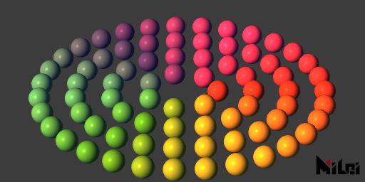

```lua:pll.lua
version3()
dim3()
move(width/2,height/2,0)

n=4

phong()

ambientLight(0.2,0.5,1,2)
parallelLight(1,0.5,0.2,2,1,-1,1)
noStroke()

for r=1,n do
    local ra = r*50
    local cn = math.floor(ra*TPI/40)
    for i=1,cn do
        beginGroup()
        rotateZ(d2r(i/cn*360))
        fill(hsl2rgb(i/cn,0.5,0.5))
        move(ra,0,0)
        ball(15,3)
        endGroup()
    end
end
```

--- 

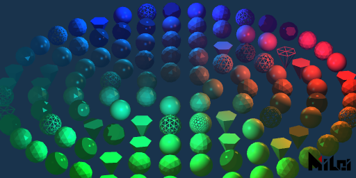

```lua:light_effects.lua
version3()
dim3()
background(0.1,0.2,0.3)
move(width/2,height/2,0)
math.randomseed(1)
n=5

ambientLight(0.2,0.5,1,1)
parallelLight(1,0.5,0.2,0.1,1,-1,1)

beginGroup()
move(200,0,-100)
pointLight(1,0.5,0.2,1,200,100)
endGroup()

beginGroup()
move(-30,200,-100)
pointLight(0,1,1,1,200,100)
endGroup()

beginGroup()
move(-30,-200,-100)
pointLight(0,1,1,1,200,100)
endGroup()


noStroke()

for r=1,n do
    local ra = r*50
    local cn = math.floor(ra*TPI/40)
    for i=1,cn do
        beginGroup()
        rotateZ(d2r(i/cn*360))
        fill(hsl2rgb(i/cn,r/n,0.6))
        move(ra,0,0)

        if math.random() < .15 then
        wireframe()
        else noWireframe() end
        
        if math.random() < .15 then 
        anime()
        else phong() end

        if math.random() <.8 then
            if math.random() < .3 then 
                ball(15,3)
            else ball(15,2) end
        else cone(15,30,6) end

        endGroup()
    end
end
```


## clearLight

`clearLight()` removes all lights in the scene. 

## getLight

1. `getLight(matchName)`
1. `getLight()` equals to `getLight("*")`

> - Gets lights that match the name `matchName`.
> - `matchName` rules：If `matchName` doesn't end up with character `"*"`, it searches one Ae lights that its name is `matchName`, otherwise, it includes all Ae lights that begin with `matchName`. 
> - Supported Ae lights: ambient,point,parallel

## aeCamera

`aeCamera()` sets the Ae activated camera to the scene camera of PixelsWorld. 

## lookAt

1. `lookAt(eyePosX,eyePosY,eyePosZ,objPosX,objPosY,objPosZ,upVecX,upVecY,upVecZ)` sets the location and orientation of the current scene camera. 
1. `lookAt(eyePosX,eyePosY,eyePosZ,objPosX,objPosY,objPosZ)` equals to `lookAt(eyePosX,eyePosY,eyePosZ,objPosX,objPosY,objPosZ,0,-1,0)`

> - `eyePos` is the location of your eyes, `objPos` is the location of the object you are looking at,`upVec` the direction the top of your head pointing to. 
> - Note: The Y-axis in Ae is downward by default, usually set the `upVec` to (0,-1,0) is enough.
> - `eyePos` and `objPos` cannot be too close. (should be bigger than `1e-7`).
> - `upVec` cannot be parallel to your sight.
> - The length of `upVec` cannot be too small.

## viewSpace


1. `viewSpace(width,height,distanceToPlane,farLevel)`
1. `viewSpace(width,height,distanceToPlane)` equals to `viewSpace(width,height,distanceToPlane,4)`

> - `width` and `height` is the dimension of the far plane. 
> - The perpendicular distance from the camera to the camera's far plane is `distanceToPlane`
> - `farLevel * distanceToPlane` is the clip plane distance. Objs that farther than this distance will be clipped out. Normally it is enough to leave the `farLevel` 4, set it to a higher number if your scene is pretty vast. Note that if the `farLevel` is too high, the depth test precision of near objs may decline. 

## strokeWidth

`strokeWidth(width)`
> Default: 2

## strokeDivision

`strokeDivision(level)`
> Default: 3

## strokeGlobal

`strokeGlobal()` draw lines globally. Lines will no longer be squeezed by `scale` function. 
> - Default: local

## strokeLocal

`strokeLocal()` draw lines locally. Lines will be squeezed by `scale` function.
> - Default: local

## dotRadius

`dotRadius(radius)`
> - Default: 2


```lua:dotRadius.lua
version3()
background(1)
fill(0,1,1)
dot(1,0,0)
move(100,100)
for i=1,7 do
    dotRadius(i/2)
    rect(40)
    move(50,0)
end
```

## dotDivision

`dotDivision(level)`
> - Default: 3
> - Maximum: 7


```lua:dotDivision.lua
version3()
background(1)
fill(0,1,1)
dot(1,0,0)
dotRadius(10)
move(100,100)
for i=0,4 do
    dotDivision(i)
    rect(40)
    move(70,0)
end
```

## dotGlobal

`dotGlobal()` Draw points globally. Points will no longer be squeezed by `scale` function. 
> - Default: local


```lua:dotGlobal.lua
version3()

dot(1,0,0)
dotGlobal()

move(50,100)

beginGroup()
for i=1,13 do
    beginGroup()
    scale(1/i)
    rect(50)
    endGroup()
    move(50/i+20,0)
end
endGroup()
```

## dotLocal

`dotLocal()` Draw points locally. Points will be squeezed by `scale` function. 
> - Default: local


```lua:dotLocal.lua
version3()

dot(1,0,0)
dotLocal()

move(50,100)

beginGroup()
for i=1,13 do
    beginGroup()
    scale(1/i)
    rect(50)
    endGroup()
    move(50/i+20,0)
end
endGroup()
```

## smooth

`smooth()` Smooth render mode. 
> Default: on
> The smooth strength can be changed in the plugin panel. 

## noSmooth

`noSmooth()` Pixel art render mode. 
> The priority of this function is higher than the settings in the plugin panel.

## r2d

`r2d(degrees)` radians to degrees, return degrees. 

## d2r

`d2r(radians)` degrees to radians, return radians

## map

`map(value,in1,in2,out1,out2)` maps value `value` from range `in1~in2` to range `out1~out2`. 

> If `in1` equals to `in2`, if `value<in1` this function returns `out1`, otherwise `out2`. 


## clamp

`clamp(value,lower,upper)`clamps `value` into range `[lower,upper]`, returns clamped value. 

> - New in `v3.2.0`
> - Namely, if `value` is between `lower` and `upper`, this function returns `value`; If `value` is less than `lower`, it returns `lower`; If `value` is greater than `upper`, it returns `upper`. 

## step

`step(value,threshold)` returns 0 if `value<threshold`, otherwise, returns 1.

> - New in `v3.2.0`

## smoothStep

`smoothStep(value,lower,upper)` returns 0 if `value<lower`, returns 1 if `value>higher`1, otherwise, returns the smooth interpolation between `lower` and `higher` basing on `value`. 

Formula of interpolation: 

$$
t := \frac{x - lower}{upper - lower}
$$

$$
Result:=t^2(3 - 2t)
$$

> - New in `v3.2.0`

## bezier

`bezier(t,p0,p1,...,pn)` returns the `n` times bezier interpolation basing on `p0,p1,...,pn`. 

The formula of interpolation: 

$$
Result := \sum_{k=0}^n{C_n^k\cdot (1-t)^{n-k}\cdot t^k\cdot p_k}
$$

$$
C_n^k:=\frac{n!}{(n-k)!k!}
$$


> - New in `v3.2.0`
> - The maximum of `n` is `66`. 

## Color conversion

`xxx2xxx` allows the following color conversion: 


For example, if you want to convert a `hsl` color to `rgb` format, then you need to call the function `hsl2rgb`, both the number of input and output parameters are 3. 

All conversions are done in the range `0~1`. 

> - New in `v3.2.0`


```lua:color_convert.lua
version3()

dim3()
strokeWidth(0.5)
stroke(0)

move(width/2,height/2,0)
for x = -5,5 do
    for y =-5,5 do
        for z=-5,5 do
            beginGroup()
            move(x*15,y*15,z*15)
            fill(cmy2rgb(x/10+.5,y/10+.5,z/10+.5))
            cube(12)
            endGroup()
        end
    end
end
```


## utf8ToLocal

`utf8ToLocal(str)` unicode string to local string. 

> Call this function to translate paths while you are handling Lua's `io` module. 

## localToUtf8

`localToUtf8(str)`local string to unicode string

## getGLInfo

`getGLInfo()` gets the information of the current graphics card. 

## getDrawRecord

1. `getDrawRecord(needStringFormat)` gets current draw records. `needStringFormat` is a boolean, when `true`, returns a string, otherwise, returns a Lua table.
1. `getDrawRecord()` equals to `getDrawRecord(true)`


```lua:printDrawRecord.lua
version3()
move(width/2,height/2)
dim3()
cube()
println(getDrawRecord());
```


## getStatus

1. `getStatus(needStringFormat)`gets the current Paintbrush status. `needStringFormat` is a boolean, when `true`, returns a string, otherwise, returns a Lua table.
1. `getStatus()` equals to `getStatus(true)`


## getAudio

> Make sure you have PixelsWorld `v3.4.0+`

1. `getAudio([startTime,duration[,id[,sampleRate,startFrequency,endFrequency[,resolution]]]])` fetches the audio data. Returns 6 tables. The first 2 are wave sample tables(Left and Right), the next 2 are fft result tables(Left and Right), the last 2 are spectrum tables(Left and Right). 

> - Left wave sample range: (-1~1)
> - Right wave sample range: (-1~1)
> - Left FFT range: (0~infinity)
> - Right FFT range: (0~infinity)
> - Left spectrum sample range: (0~infinity)
> - Right spectrum sample range: (0~infinity)

```lua:waveInfo.lua
version3()
castTex(OUTPUT,INPUT)

local wl,wr,ftl,ftr,specl,specr = getAudio()

local nm = math.floor(height/8);

for i=1,nm do
    local wid =math.max(math.floor(i/nm*#wl),1)
    local fid = math.max(math.floor(i/nm*#specl),1)
    print(string.format("%8.5f",wl[wid]),wl[wid]*4,0,-wl[wid]*4)
    print("  < L  R >  ",1,0,0,0)
    print(string.format("%8.5f",wr[wid]),wr[wid]*4,0,-wr[wid]*4)
    print("      <   Wave  FFT   >      ",0.5,0.5,0.5)
    print(string.format("%8.5f",specl[fid]),specl[fid],0,0)
    print("  < L  R >  ",1,0,0,0)
    print(string.format("%8.5f",specr[fid]),0,0,specr[fid])
    println("");
end
```

## saveString

`saveString(utf8_path,string)` saves string to local path. 

## loadString

`loadString(utf8_path)` reads local txt file then returns string. 

## getColor

`getColor(id,x,y)` get pixel color at location (x,y) of texture `id`. Returns `r,g,b,a` 4 doubles.
`getColor(x,y)` equals to `getColor(INPUT,x,y)`

> - It is highly efficient to call `getColor` before any draw function(Such as immediately after `version3()`). Otherwise, it is very low efficient since it queries pixels from the graphic card. 
> - Valid `id`: `INPUT`,`OUTPUT`,`PARAM0`~`PARAM9`

## setColor

`setColor(x,y,r,g,b,a)` set the pixel at location (x,y) of texture `OUTPUT`. 
> - It is highly efficient to call `setColor` before any draw function

## getSize

`getSize(id)` returns the size of texture `id`. (Two doubles, width, and height)

> Due to the Ae's downsample (1/2,1/4) mechanism, the size you get would variating 0~4px. But this kind of variating doesn't change with time. The size is promised to be accurate in full resolution(without downsample). 

## shadertoy

`shadertoy(code)` runs code from shadertoy.com. 

> - Not all code on shadertoy.com is supported. 

## glsl

`glsl(code)` runs fragment stage shader code. 

## cmd

`cmd(code)` runs cmd code. 

> This function is equivalent to the ISO C function system. It passes a command to be executed by an operating system shell. Its first result is true if the command terminated successfully, or nil otherwise. After this first result the function returns a string plus a number, as follows:

> - "exit": the command terminated normally; the following number is the exit status of the command.
> - "signal": the command was terminated by a signal; the following number is the signal that terminated the command.

## lua

`lua(code)` runs lua code. 

## runFile

`runFile(utf8_path)` loads local lua code and run. 

> No need to call `utf8ToLocal` since it supports utf8. 


## txt

`txt(utf8_path)` loads local text file. Returns string. 

> No need to call `utf8ToLocal` since it supports utf8. 


