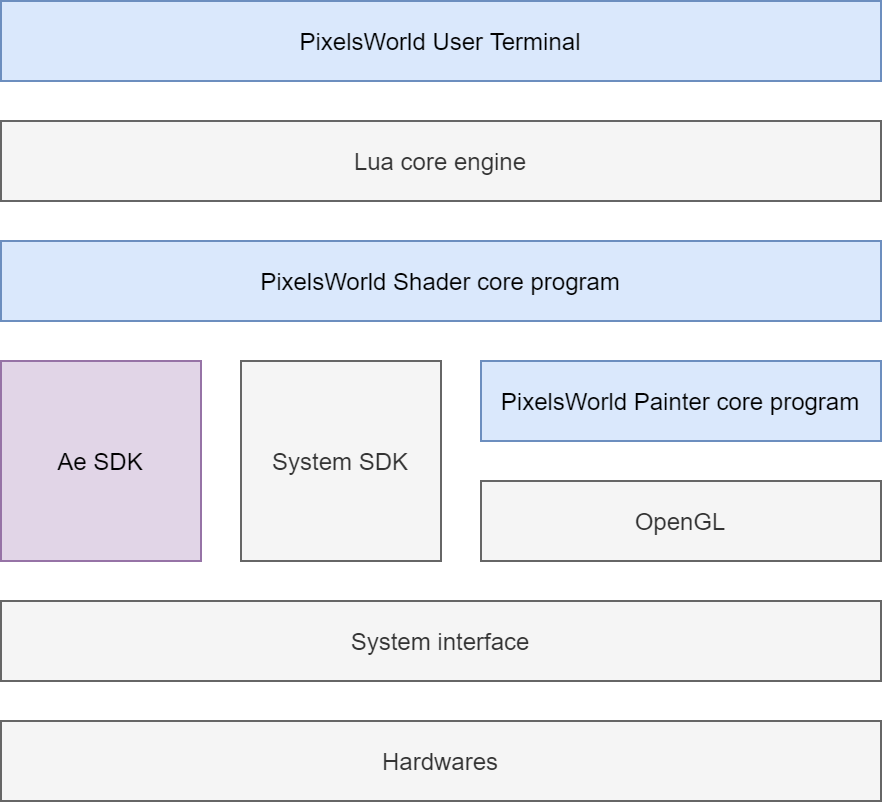

#Lua コード
---

最初の第一章で紹介した言語の名前は**Lua**でした。

>*Luaは手続き型・プロトタイプベースのオブジェクト指向・関数型・データ駆動型のスクリプト言語である。* [--Wiki](https://ja.wikipedia.org/wiki/Lua)

**Luaバージョン：[Lua5.3](https://www.lua.org/manual/5.3/)**

> 注意：`PixelsWorld v3.2.0`より、[Lua5.4](https://www.lua.org/manual/5.4/)に変更しました。


簡単に言えば、Luaは、Aeとユーザーの間の架け橋であり、コミュニケーション通路の役を果たしています。LuaはAeスクリプト言語に似ているため、プログラミング経験ゼロの人でもPixelsWorldを楽しめます。また、小行数のスクリプトでもバラエティー満ちたシーンを構築可能です。例えば、Aeカメラでキューブをレンダーするには、次のコードを書けば十分です：

```lua:DrawCube.lua
version3()
move(width/2,height/2)
dim3()
cube(300)
```

> `dim3()`は三次元モードでレンダーするという意味です。

GLSLコードをレンダーするには、次のように書きます：

```lua:RunGlsl.lua
version3()
glsl([==[
void main(){
    vec3 col = 0.5 + 0.5*cos(time+uv.xyx+vec3(0,2,4));
    outColor = vec4(col,1.0);
}
    ]==])
```

[shadertoy](shadertoy.md)のコードをレンダーするには、次のように書きます：

```lua:RunShadertoy.lua
version3()
shadertoy([==[
void mainImage( out vec4 fragColor, in vec2 fragCoord )
{
    vec2 uv = fragCoord/iResolution.xy;
    vec3 col = 0.5 + 0.5*cos(iTime+uv.xyx+vec3(0,2,4));
    fragColor = vec4(col,1.0);
}
    ]==])
```

Luaでは、次のことができます： 
- ピクセルデータの読み取り
- ピクセルデータの書き込み
- JavaScriptの実行
- GLSLの実行
- パラメーターの読み取り
- 外部Cライブラリの実行 **(COOL!)**
- 外部Luaモデルの読み取り

## PixelsWorld構成図



