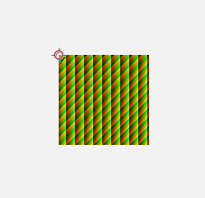

# 創世神啓示録——Poly関数

`poly(obj)`関数は、objを解析して物体を描画します。


## 使用例

> Houdiniをご使用の方は、`obj`の構造プロセスがHoudiniのスプレッドシートを埋めるのに似ていることを確認できます。

以下の例では、特異な三角形の`obj`を構築しています。


```lua:PolyTest1.lua
version3()
background(0.95)
move(width/2,height/2)
dim3()
dotRadius(5)
obj={
    point={
        {p={0,0,0},color={0,1,1}},
        {p={100,0,0},color={1,1,0}},
        {p={0,100,0},color={1,0,1}},
        {p={100,100,0},color={1,0,0}},
    },
    prim={
        {type="triangle",pref={1,2,3}},
        {type="line",pref={2,3,3,4,4,2}},
        {type="point",pref={2,4}},
    }
}
poly(obj)
```


## サポートするプリミティブと名前

以下に`pref={1,2,3,4,5,6}`を例として説明します。

> - `pref`は`point reference`の意味で、参照点の番号を指し、プリミティブは送られた番号の順に描画されます。
> - セミコロン（`;`）は1回のプリミティブ描画の終わりを示します。

| 標準名称(type name) | 対応するプリミティブ | 描画順序 | 全称 |
|---|---|---|---|
|points|点|`1;2;3;4;5;6;`|points|
|pointd|平面点|`1;2;3;4;5;6;`|point disc|
|pointb|球点|`1;2;3;4;5;6;`|point ball|
|line|1本の線|`123456;`|single line|
|linef|平面線|`123456;`|line flat|
|linec|立体線|`123456;`|line capsule|
|linel|ループ線|`1234561;`|line loop|
|linelf|ループ平面線|`1234561;`|line loop flat|
|linelc|ループ立体線|`1234561;`|line loop capsule|
|lines|複数本の線|`12;34;56;`|lines|
|linesf|複数本の平面線|`12;34;56;`|lines flat|
|linesc|複数本の立体線|`12;34;56;`|lines capsule|
|triangles|三角面|`123;456;`|triangles|
|triangleb|橋状三角面|`123;324;345;546;`|triangle bridge|
|triangler|放射状三角面|`123;134;145;156;`|triangle radial|


## objの構築

ここでは、以下の順序でobjの詳細を定義します。

- `obj`はテーブルです。
- `obj`は4つのキー：`point`、`vertex`、`prim`、`detail`を持つことができます。
- `obj`の4つのキーに対応する値は、それぞれ４つのテーブルです。これを`pointArray`、`vertexArray`、`primArray`、`detailList`と呼びます。
- `pointArray`は存在する必要があります。
- `vertexArray`はオプションです。
- `primArray`は存在する必要があります。
- `detailList`はオプションです。
- 上述した`Array`のサフィックスが付くテーブルはN個のサブテーブルを含むことができ、Nのサイズは自由に定義できます。
- `pointArray`の第k個のサブテーブルは`point[k]`あるいは“第kの点”と呼ぶことができます。
- `vertexArray`の第k個のサブテーブルは`vertex[k]`あるいは“第kのサブ点”と呼びます。
- `primArray`の第k個のサブテーブルは`prim[k]`あるいは“第kのプリミティブ”と呼びます。
- `detailList`及び、上述の点、サブ点、プリミティブには、それ以上細分可能でないユニット、すなわちキーと値のペアが含まれます。これらのキーを一時的に`K`、値を`V`と呼びます。
- `K`は英数字とアンダースコアのみを含むことをお勧めし、純数字でないことをお勧めします。
- `V`には一次元、二次元、三次元、四次元、文字列、テクスチャID、及びインデックス集合の7種類があります。
- 任意の浮動小数点数`x,y,z,w`について
- `x`または`{x}`は一次元`V`と呼びます。
- `{x,y}`は二次元`V`と呼びます。
- `{x,y,z}`は三次元`V`と呼びます。
- `{x,y,z,w}`は四次元`V`と呼びます。
- `"Hello! PixelsWorld!"`は文字列`V`として呼びます。
- (`K`の末尾4文字`"_tex"`)かつ(`V`が整数で対応テクスチャが存在する)場合、これはテクスチャID`V`として呼びます。
- 整数列`a1,...,an`の場合、`{a1,a2,a3,...,an}`をインデックス集合`V`として呼びます。
- 各点`point[k]`について、点の位置を表す`K`として`"p"`が存在する必要があります。そうでなければ無効な点と見なされます。
- 各サブ点`vertex[k]`について、参照点IDを表す`K`として`"pref"`が存在し、一次元`V`を持つ必要があります。そうでなければ無効なサブ点と見なされます。
- 各プリミティブ`prim[k]`について、プリミティブの種類を表すために`"type"`という`K`と文字列`V`が存在する必要があり、同時にプリミティブの描画点順序を表すために`"vref"`または`"pref"`の`K`とインデックス集合`V`が存在する必要があります。

## オーバーライド優先順位

同じ名前の`K`に対し、次のようなオーバーライド優先順位を定義します：

> `Houdini`と同様

1. vertex
2. point
3. prim
4. detail

使用例：

以下の`obj`の`prim`には色情報（赤色）が含まれているため、最終的に赤色のみの三角形が生成されます。


```lua:PrimColor.lua
version3()
background(0.95)
move(width/2,height/2)
dim3()
obj={
    point={
        {p={0,0,0}},
        {p={100,0,0}},
        {p={0,100,0}},
    },
    prim={
        {type="triangle",pref={1,2,3},color={1,0,0}},
    },
}
poly(obj)
```

---

一方、こちらの`obj`では`prim`と`point`の両方に`color`があるため、`point`がより高い優先順位を持ち、最終的にカラフルな三角形が描画されます。


```lua:PointColor.lua
version3()
background(0.95)
move(width/2,height/2)
dim3()
obj={
    point={
        {p={0,0,0},color={0,1,1}},
        {p={100,0,0},color={1,1,0}},
        {p={0,100,0},color={1,0,1}},
    },
    prim={
        {type="triangle",pref={1,2,3},color={1,0,0}},
    },
}
poly(obj)
```

## Vertexの使用方法

Vertex（サブ点）はPoint（点）の情報を継承できます。


```lua:VertexColor.lua
version3()
background(0.95)
move(width/2,height/2)
dim3()
obj={
    point={
        {p={0,0,0}},
        {p={100,0,0}},
        {p={0,100,0}},
        {p={100,100,0}},
    },
    vertex={
        {pref=1,color={1,0,0}},
        {pref=2,color={1,0,0}},
        {pref=3,color={1,0,0}},
        {pref=2,color={0,1,0}},
        {pref=3,color={0,1,0}},
        {pref=4,color={0,1,0}},
    },
    prim={
        {type="triangle",vref={1,2,3,4,5,6}},
    },
}
poly(obj)
```

> - `pref`は現在のvertexがどのpointを参照しているかを指し示します。`pref`は`Point reference`の省略形です。
> - `prim`内の`vref`は`Vertex reference`の省略形です。
> - 注意：Luaのテーブルでは、最初の要素の番号は0ではなく1です。

---

Vertexを使用しない場合は、このようになります：


```lua:NoVertex.lua
version3()
background(0.95)
move(width/2,height/2)
dim3()
obj={
    point={
        {p={0,0,0},color={1,0,0}},
        {p={100,0,0},color={1,0,0}},
        {p={0,100,0},color={1,0,0}},
        {p={100,100,0},color={0,1,0}},
    },
    prim={
        {type="triangle",pref={1,2,3,2,3,4}},
    },
}
poly(obj)
```


## シェーダーの付属

Polyの中でシェーダー言語を使用することも可能です。



```lua:FragColor.lua
version3()
background(0.95)
move(width/2,height/2)
dim3()
obj={
    point={
        {p={0,0,0},myattribute={1,0}},
        {p={100,0,0},myattribute={0,1}},
        {p={0,100,0},myattribute={0,0}},
        {p={100,100,0},myattribute={1,1}},
    },
    prim={
        {
            type="triangle",
            pref={1,2,3,2,3,4},
            frag=[==[
                #define t ]==] .. tostring(time) .. [==[

                void main(){
                    outColor = vec4(mod(myattribute*10+vec2(t),1),0,1);
                }
            ]==],
        },
    },
}
poly(obj)
```
## テクスチャの使用

> - 下記のobjは、入力レイヤーをテクスチャとして使用し、シーンに出力します。
> - ある整数属性値のキー名に`_tex`が付いている場合、その属性はテクスチャIDとして扱われます。
> - カスタムシェーダーを使用することで、1つのprimで複数のテクスチャを使用することが可能です。
> - [テクスチャに関する詳細情報](./Texture.md)

```lua:UVTex.lua
version3()
background(0.95)
move(width/2,height/2)
dim3()
obj={
    point={
        {p={0,0,0},uv={0,0}},
        {p={100,0,0},uv={1,0}},
        {p={0,100,0},uv={0,1}},
        {p={100,100,0},uv={1,1}},
    },
    prim={
        {
            type="triangler",
            pref={1,2,4,3},
            my_tex=INPUT,
        },
    },
}
poly(obj)
```