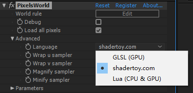

#shadertoy.com Code
---
##用法
在此模式下，你可以直接使用来自 [shadertoy.com](https://shadertoy.com)的代码。


> **注意** <br/>并非所有来自 shadertoy.com的代码均可在PixelsWorld下完美运行 (比如带有音频输入或者需要VR支持的代码)

##细节
当输入来自 [shadertoy.com](https://shadertoy.com)的代码时，PixelsWorld 会进行**语法分析**(将shadertoy.com代码协议转为PixelsWorld的)并且会**改变输入代码**。也就是说，下次打开编辑窗口时，可能会得到不同的代码内容 (当变量名称与PW内部变量发生**冲突**时，就会发生此情况).

示例 :  导入以下代码
```glsl:InputShadertoy.shader
void mainImage( out vec4 fragColor, in vec2 fragCoord ){
vec2 uv = fragCoord/iResolution.xy;
fragColor = vec4(uv,0,1);
}
```
会提供漂亮的uv色彩图案

再次打开编辑器， 你会得到类似以下代码:
```glsl:LaterShadertoy.shader
void mainImage( out vec4 fragColor, in vec2 fragCoord ){
vec2 pw_user_uv = fragCoord/iResolution.xy;
fragColor = vec4(pw_user_uv,0,1);
}
```
你会发现变量 ```uv``` 变成了```pw_user_uv```.

这是因为PixelsWorld已经存在变量uv。我们会添加前缀 ```pw_user_```  来避免名称冲突。 

以下是会被修改的变量列表：
- uv
- outColor
- getColor
- uv2xy
- xy2uv
- slider
- angle
- checkbox
- point
- point3d
- color
- layer
- layerResolution
- inLayer
- time
- fps
- width
- height
- origin
- resolution
- INPUT_LAYER_INDEX
- OUTPUT_LAYER_INDEX
- platform
- host