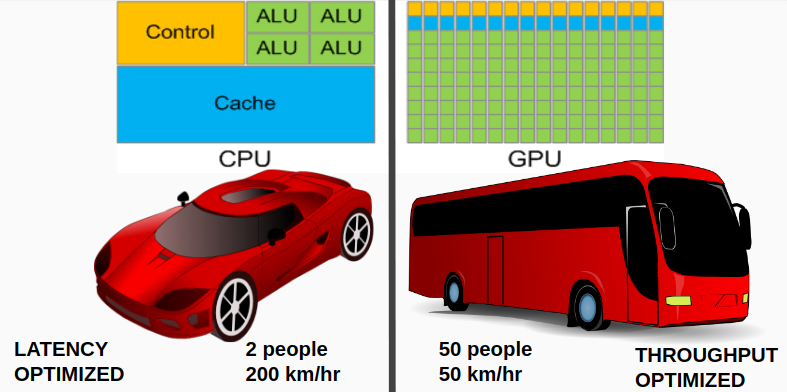

# 显卡狂战士GLSL
---
本节中, 我们将快速了解如何在像素世界里运行GLSL 

## GLSL是什么?
 
> GLSL是OpenGL Shader Language的缩写，它是OpenGL支持的基于GPU的渲染语言。
> 主要通过编写像素渲染规则，使用GPU进行计算。

### 简而言之
GLSL就是我们在[第一节](../../README.md)中使用的语言，它能运行在显卡上。

### 显卡语言的优势

如果把主板上的*中央处理器(CPU)*和显卡上的*图形处理器(GPU)*做比较的话，CPU像是一辆超级跑车，GPU则像是一辆大型客车。



在一段路程间运输少量人员的话，用一辆超级跑车表现会非常优秀。

但是如果想要做重复性非常高的工作——比如计算一张图像——这时就可以比喻作有成百上千的人员需要移动，那么这时，选择一辆大型客车显然才是明智之举。

我们平时学习的编程语言，诸如C/C++、Java、Python，大都是直接运行在CPU上的。

而GLSL这样的语言，是为了运行在GPU上而设计的语言。

在处理一张图像的时候，GPU可以同时派出非常多的*“工人”*去做重复性高的工作，而具体的工作内容就由GLSL来指定。


> 关于GLSL语法的更多信息 ,  建议您访问 [shadertoy.com](https://www.shadertoy.com/).  找到一些有趣且简单的效果，来探索它是如何生效的。 

## 细节 : 

在运行GLSL前我们会预定义非常多的变量和函数，如果您是初学者，可以暂时忽略这里。

- **PixelsWorld V2.0** 使用的是 **#version 330 core**. 

下面是额外的预定义代码

### GLSL模式预定义

```glsl:extra.shader
#version 330 core
#define platform 0 // If you are on windows platform
#define platform 1 // If you are on mac platform
#define platform -1 // If you are on unknown platform
#define host 0 // If you are on Ae host 
#define gl_Position uv2xy(uv)
#define gl_FragCoord uv2xy(uv)
#define gl_FragColor outColor
#define INPUT_LAYER_INDEX -1
#define OUTPUT_LAYER_INDEX -2
out vec4 outColor;
in vec2 uv;
uniform float slider[10];
uniform float angle[10];
uniform bool checkbox[10];
uniform vec2 point[10];
uniform vec3 point3d[10];
uniform vec4 color[10];
uniform sampler2D layer[10];
uniform vec2 layerResolution[10];
uniform sampler2D inLayer;
uniform sampler2D outLayer;
uniform float time;
uniform vec4 date;
uniform float fps;
uniform float width;
uniform float height;
uniform vec2 origin;
uniform vec2 resolution;


vec4 getColor(int layerId,vec2 coord)
{
	if(layerId==INPUT_LAYER_INDEX) return texture(inLayer,coord);
	if(layerId==OUTPUT_LAYER_INDEX) return texture(outLayer,coord);
	else if(layerId>=0 && layerId<=9) return texture(layer[layerId],coord);
	return vec4(0.0);
}

vec4 getColor(vec2 coord)
{
	return texture(inLayer,coord);
}

vec2 uv2xy(vec2 myuv){
	return myuv*resolution;
}

vec2 xy2uv(vec2 myxy){
	return myxy/resolution;
}

```

### shadertoy模式预定义


```glsl:extra_shadertoy_front.shader

#define gl_Position (_PixelsWorld_uv * iResolution.xy)
#define gl_FragCoord (_PixelsWorld_uv * iResolution.xy)
#define gl_FragColor _PixelsWorld_outColor
uniform vec3 iResolution;
uniform float iTime;
uniform float iTimeDelta;
uniform int iFrame;
uniform vec4 iMouse;
uniform vec4 iDate;
uniform sampler2D iChannel0;
uniform sampler2D iChannel1;
uniform sampler2D iChannel2;
uniform sampler2D iChannel3;
uniform vec3 iChannelResolution[4];

#define INPUT_LAYER_INDEX -1
#define OUTPUT_LAYER_INDEX -2

uniform float _PixelsWorld_slider[10];
uniform float _PixelsWorld_angle[10];
uniform bool _PixelsWorld_checkbox[10];
uniform vec2 _PixelsWorld_point[10];
uniform vec3 _PixelsWorld_point3d[10];
uniform vec4 _PixelsWorld_color[10];
uniform sampler2D _PixelsWorld_layer[10];
uniform vec2 _PixelsWorld_layerResolution[10];
uniform sampler2D _PixelsWorld_inLayer;
uniform sampler2D _PixelsWorld_outLayer;
uniform float _PixelsWorld_time;
uniform vec4 _PixelsWorld_date;
uniform float _PixelsWorld_fps;
uniform float _PixelsWorld_width;
uniform float _PixelsWorld_height;
uniform vec2 _PixelsWorld_origin;
uniform vec2 _PixelsWorld_resolution;

in vec2 _PixelsWorld_uv;
out vec4 _PixelsWorld_outColor;

```

### shadertoy模式后置定义

```glsl:extra_shadertoy_back.shader
void main(){
	mainImage(_PixelsWorld_outColor, _PixelsWorld_uv * iResolution.xy);
}
```

<br><br><br><br><br><br><br>