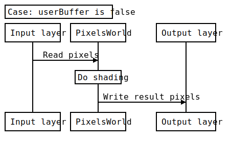

#在lua中运行GLSL
---

##用法
###pw.glsl(GLSLcode[, useBuffer])

- GLSLcode: 字符串，源分段代码。 如果您输入的代码可以在 **GLSL渲染模式**下运行， 则可在此处直接使用 (此处不支持来自shadertoy.com的代码)
- useBuffer : 布尔值，可选参数。默认为false。 如果为true，PixelsWorld会生成临时内存来储存渲染结果。GLSL渲染完毕后，临时储存器中的数据会覆盖输出层的像素数据。
<br/><br/>

> 如果每帧仅调用一次pw.glsl函数，则`useBuffer`可以忽略<br>
> 简而言之`useBuffer`将在第二次调用pw.glsl的时候，允许您使用上一个glsl的渲染结果。
> 如果想使用上一个shader的渲染结果，请使用`getColor(OUTPUT_LAYER_INDEX,uv)`。

关闭`useBuffer`的渲染模式：<br>


开启`useBuffer`的渲染模式：<br>


以下代码可以帮助了解 useBuffer：
> 注意：<br/>
> 1. 您可以使用`[==[` 和 `]==]`符号包裹住多行代码。

```lua:useBuffer_on.lua
pw.glsl(
    [==[
        void main(){
            outColor = vec4(uv,0,1);
        }
    ]==]
);

pw.glsl(
    [==[
        void main(){
            vec3 outlayerColor = getColor(OUTPUT_LAYER_INDEX,uv).rgb;
            outColor = vec4(vec3(1)-outlayerColor,1);
        }
    ]==],true
);
```

```lua:useBuffer_off.lua
pw.glsl(
    [==[
        void main(){
            outColor = vec4(uv,0,1);
        }
    ]==]
);

pw.glsl(
    [==[
        void main(){
            vec3 outlayerColor = getColor(OUTPUT_LAYER_INDEX,uv).rgb;
            outColor = vec4(vec3(1)-outlayerColor,1);
        }
    ]==],false
);
```

