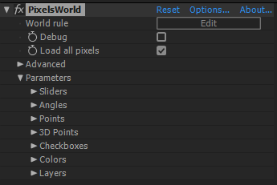

#Link parameters
---
The outside parameters are provided for you to do some animation. 
<br>


As you can see, there are 7 types of parameters are provided. 
- Sliders
- Angles
- Points
- 3D Points
- Checkboxes
- Colors
- Layers

Each of them have 10 controler for using. 

**Example :**
```glsl:link_slider.shader
 void main(){
    outColor = vec4(uv,slider[0],1.0);
}
```
 If you change the slider 0, the color in your scene would change.
<br>

 


##Details
The  parameters decleared in PixelsWorld are as below : 
```glsl:parameters.shader
uniform float slider[10];
uniform float angle[10];
uniform bool checkbox[10];
uniform vec2 point[10];
uniform vec3 point3d[10];
uniform vec4 color[10];
uniform sampler2D layer[10];
uniform sampler2D inLayer;
```
> **NOTE : **
> - The **"inLayer"** means Input layer. 
> - The **sampler2D** is a value type provided by GLSL, you don't need to understand this value type. If you want to use the layer parameter. Please see the ["getColor"](getColor.md) section
> - **"uniform"** means global value. This is to tell the GPU that "You don't need to malloc memory and initialize them for each *'GPU worker'*, just do these when the *"GPU Boss of works"* start working. " So on the other hand, **"uniform"** declearation almost shows up outside your function. 