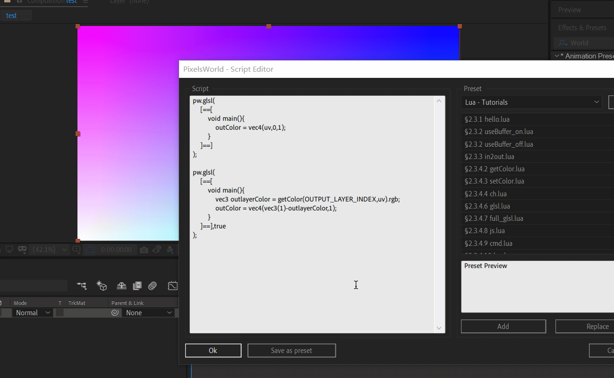

#在lua中运行GLSL
---

##用法
###pw.glsl(GLSLcode[, useBuffer])

- GLSLcode: 字符串，源分段代码。 如果您输入的代码可以在 **GLSL渲染模式**下运行， 则可在此处直接使用 (此处不支持来自shadertoy.com的代码)
- useBuffer : 布尔值，可选参数。默认为false。 如果为true，PixelsWorld会生成临时内存来储存渲染结果。GLSL渲染完毕后，临时储存器中的数据会覆盖输出层的像素数据。
<br/><br/>

> 如果每帧仅调用一次pw.glsl函数，则`useBuffer`可以忽略<br>
> 简而言之`useBuffer`将在第二次调用pw.glsl的时候，允许您使用上一个glsl的渲染结果。
> 如果想使用上一个shader的渲染结果，请使用`getColor(OUTPUT_LAYER_INDEX,uv)`。

关闭`useBuffer`的渲染模式：<br>


开启`useBuffer`的渲染模式：<br>


以下代码可以帮助了解 useBuffer：
> 注意：<br/>
> 1. 您可以使用`[==[` 和 `]==]`符号包裹住多行代码。

```lua:useBuffer_on.lua
pw.glsl(
    [==[
        void main(){
            outColor = vec4(uv,0,1);
        }
    ]==]
);

pw.glsl(
    [==[
        void main(){
            vec3 outlayerColor = getColor(OUTPUT_LAYER_INDEX,uv).rgb;
            outColor = vec4(vec3(1)-outlayerColor,1);
        }
    ]==],true
);
```

```lua:useBuffer_off.lua
pw.glsl(
    [==[
        void main(){
            outColor = vec4(uv,0,1);
        }
    ]==]
);

pw.glsl(
    [==[
        void main(){
            vec3 outlayerColor = getColor(OUTPUT_LAYER_INDEX,uv).rgb;
            outColor = vec4(vec3(1)-outlayerColor,1);
        }
    ]==],false
);
```




## 高效化

使用上面的方法效率会**非常低**。

因为我们每执行一次代码，像素世界都会把结果返回给Ae一次！然后第二个shader还需要把结果再从Ae读回去！**这很低效**。

除非你想在两个shader之间想用Lua读取输出像素做点计算——而大部分时间我们没这个需求。我们想让GPU算完所有的特效再返回结果给Ae。


这时候你需要用下面的方式渲染：

```lua
pw.beginShaders()
pw.glsl(第一个glsl代码)
pw.glsl(第二个glsl代码)
...
pw.glsl(第N个glsl代码)
pw.endShaders()
```

我们在首尾分别加上`pw.beginShaders()`和`pw.endShaders()`，这样像素世界会在`endShaders`给Ae汇报渲染结果，省去了中间每一步都返回一张图像的时间。

这会**非常高效**！它的原理跟我们玩游戏是一样的，像素世界会在`beginShaders`和`endShaders`之间建立**游戏循环**，使用纯GPU的形式，不断交换两张贴图进行计算。

> 小技巧：最后的`pw.endShaders`可以省略。如果你用了`pw.beginShaders`但是没有用`pw.endShaders`，像素世界会自动为你在最后一行加上。

`pw.shadertoy`和`pw.full_glsl`也同样支持高效化运算，你也可以**混合使用**这些渲染函数。比如：

```lua
pw.beginShaders()
pw.glsl(glsl代码)
pw.glsl(glsl代码)
pw.shadertoy(shadertoy代码)
pw.glsl(glsl代码)
pw.full_glsl(full_glsl代码)
pw.endShaders()
```

> 注意，所有在`beginShaders`和`endShaders`之间的渲染函数都强制支持上一渲染器的输出结果（并且完全不耗费时间成本）。使用`getColor(-2,uv)` 或 `getColor(OUTPUT_LAYER_INDEX,uv)` 或 `texture(outLayer,uv)`或 (在shadertoy模式下) `texture(_PixelsWorld_outLayer,_PixelsWorld_uv)`来读取上一层结果。

### 流程图

